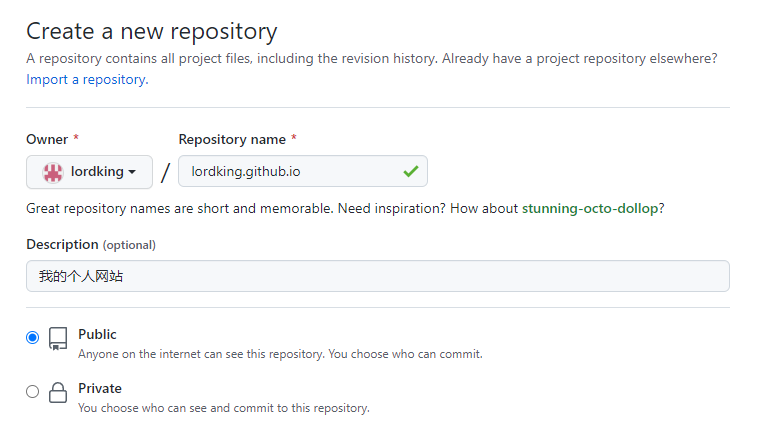
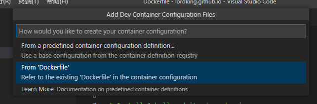

# 我的个人网站

使用GitHub Page搭建我的个人网站。

## 1 创建网站

参考资料来源于：[https://pages.github.com/](https://pages.github.com/)

### 1.1 在Github创建仓库

在GitHub创建一个新的公开仓库（`public repository`），创建时注意命名为username.github.io，username是你在GitHub的用户名称。例如我的用户名是`lordking`，那么我的个人网站就是`lordking.github.io`。为了描述方便，后面内容都以我的个人网站作为例子。



仓库创建成功后，即代表着你已经在GitHub创建了一个免费个人网站，接下来就是要放上你的网站内容。

### 1.2 克隆仓库到本地

```shell
git clone git@github.com:lordking/lordking.github.io.git
```

或者，你也可以下载[Github Desktop](https://desktop.github.com/)，克隆你的仓库到本地

或者，你可以指定一个目录

```
git init
git branch -M main
git remote add origin git@github.com:lordking/lordking.github.io.git
```

### 1.3 第一个`Hello World`网页

```
echo "Hello World" > index.html

git add --all
git commit -m "初始提交"
git push -u origin main
```

打开你的个人网站：`https://lordking.github.io/`

## 2 使用Docker安装开发环境

Jekyll是Github提供的静态网站引擎。本地安装它的目的是为了更方便地在本地编辑或者调试网站内容。

个人不建议原生安装，而是推荐使用`Docker`安装。原因是无论是Windows还是Mac，我们想要完整安装[Github指定版本的Ruby+Jekyll环境](https://pages.github.com/versions/)往往很困难，常常因为安装过程中遇到一些未知问题导致不得不大量地网上搜索资料以解决，很多时候尝试是失败的。除非你是传说中的极客，否则不建议尝试。

### 2.1 提前准备

- 安装在Windows或者Mac上的`Docker`
- `Visual Studio Code`
- `Visual Studio Code`上已经安装微软提供的`Docker`插件

### 2.2 创建Docker镜像配置文件

1. 使用`Visual Studio Code`打开本地仓库所在的文件夹，如上例，文件夹名是`lordking.github.io`

2. 创建一个文件，命名为`Dockerfile`。写入如下内容

```
FROM ruby:2.7-alpine

# 添加我们所需要的依赖到Alpine
RUN apk update
RUN apk add --no-cache build-base gcc cmake git

# 安装Jekyll，目前github支持的最新版本是3.9.2
RUN gem update bundler && gem install jekyll:3.9.2

# 设置一个工作目录
RUN mkdir -p /usr/src/app
WORKDIR /usr/src/app
```

### 2.3 生成并运行`Docker`镜像

1. 在`Visual Studio Code`输入`Shift+Command+P`（Mac）或者`Shift+Ctrl+P`（Windows）调出命令行，输入如下指令，然后回车。

```
Dev Containers: Open Folder in Container...
```

回车后，将打开对话框`选择文件夹`，选择当前文件夹`lordking.github.io`。

点击确定后将出现如下对话框，选择第二个选项`From Dockerfile`



如果成功，将会运行镜像名的开头为`vsc-`的容器

2. 在`VSCode`新建终端，进入运行镜像容器的命令行

```bash
ruby -v 

jekyll -v
```

这时候，我们可以使用Jekyll在本地定制一个个人网站了。

## 3 使用Jekyll创建并运行网站

1. 输入下面指令初始化项目，将自动生成`Gemfile`配置文件，该配置文件用于配置依赖库。
```bash
bundle init
```

2. 输入下面指令，将添加将安装依赖库`jekyll 3.9.2`，并把`jekyll 3.9.2`的配置添加到`Gemfile`中
```bash
bundle add jekyll --version "~>3.9.2"
```

3. 输入下面指令，将生成一个新的网站。
```bash
bundle exec jekyll new --force --skip-bundle .
```

4. 输入下面指令，将读取`Gemfile`文件安装需要依赖的库。如果库已经安装成功，将不会重新安装。一般我们会使用这个指令检查依赖库是否正确安装，如果没有安装将会帮助我们安装
```bash
bundle install
```

4. 输入下面指令，运行Jekyll 服务。
```bash
# Mac
bundle exec jekyll serve --livereload

# Windows
bundle exec jekyll serve --force-polling --incremental
```

打开网页后，我们会发现之前的`Hello World`依然还在。没有关系，把`index.html`文件删除掉就可以了。

## 4 配置主题

访问网站[https://rubygems.org/](https://rubygems.org/)，输入关键词`jekyll theme`搜索个人满意的主题。这里我选择了`bulma-clean-theme`。

修改`Gemfile`文件，添加选择的主题，同时加入Github Pages的支持。全部清空`Gemfile`内之前生成所有的内容，替换成如下内容。
```yml
source "https://rubygems.org"

gem "jekyll", "~> 3.9.2"
gem 'github-pages', group: :jekyll_plugins
gem 'bulma-clean-theme', '~> 0.13.1'
```

修改`_config.yml`文件，设置选择的主题
```yml
remote_theme: chrisrhymes/bulma-clean-theme
```

安装主题
```
bundle install
```

运行网站
```bash
bundle exec jekyll serve --livereload
```

**这时候打开浏览器是会发现一片空白。请不用担心，这是因为我们必须要根据该主题的操作文档定制自己的网站。请继续往下看**

## 5 定制我的网站

初次配置，不指望获得什么非常了不得的成就，主要目标是验证得到自己预想的主题风格。访问[bulma-clean-theme网站](https://jamstackthemes.dev/demo/theme/bulma-clean-theme/)，根据网站上的说明定制自己的网站。

### 5.1 个性化之前必须了解的事情

#### 1. 下载并运行主题作为参考

在本地目录中寻找一个位置，把主题下载下来，并参考以上2、3、4的章节把它们运行起来。下载并运行主题的目的是为了个性化网站时作为参考。

1. 下载主题

```bash
git clone git@github.com:chrisrhymes/bulma-clean-theme.git
```

2. 把之前的Dockerfile拷贝一份，放在下载的仓库里面。

```bash
cd lordking.github.io
copy Dockerfile ../bulma-clean-theme
```

3. 参考第2章节，使用VSCode运行镜像。

4. 安装依赖库

   在VSCode中打开终端，运行如下命令。

   ```bash
   bundle install
   ```

5. 运行主题

```bash
bundle exec jekyll serve
```

#### 2. 根据需求定制内容，无需全部复制。

安装主题后，没有必要把我们所选择的主题内的所有文件或者那些不需要编辑的文件拷贝一份到自己的个人网站的代码仓库里面。这样显得很臃肿，而且是没有必要的操作。因为`remote_theme`已经提示`Jekyll`帮助我们引用它们而无需下载它们。

我们应该根据主题所提供的使用说明个性化自己的需求，有需求就编辑，没需求就不编辑。当你没有编辑某个参数或者文件时，`Jekyll`已经帮助我们从已配置的主题中读取了默认数据。

### 5.2 个性化步骤

以下内容，仅供参考。每个主题个性化的步骤和方法不是完全一致，但大体过程如此。

#### 第一步：网站配置_config.yml

请再次注意，没有必要完全编写所有的配置参数，因为Jekyll可以从已配置的主题中拉取默认的配置。所以，我只编辑了我需要的参数。

```yml
# HTML 语言配置
lang: zh-cmn-Hans

# 网站设置
title: 今识笔记
email: lordking@163.com
description: >
  Java、Python、Rust、C、DDD、设计模式。还有那些哲学、经济学、产品、商业、管理...
baseurl: "" # the subpath of your site, e.g. /blog
url: "" # the base hostname & protocol for your site, e.g. http://example.com
twitter_username: lordking76
github_username:  lordking

# 主题设置
remote_theme: chrisrhymes/bulma-clean-theme
```

#### 第二步：编辑首页index.md

我们可以查询[在线文档](https://www.csrhymes.com/bulma-clean-theme/docs/)-`Create a Page`章节，同时参考主题源代码的`index.md`是如何写的。

1. 在根目录编辑`indext.md`
2. 编辑内容如下

```
---
title: 今识笔记
subtitle: 不积硅步，无以至千里。坚持做一名长期主义者，用时间获得最好的回答。

layout: page
show_sidebar: false
---

从这里开始....
```

#### 第三步：编辑顶部导航栏

我们可以查询在线文档-`Top navigation`章节，同时参考主题源代码的`navigation.yml`是如何写的。

**编辑`navigation.yml`文件**

1. 在`_data`目录里面创建`navigation.yml`文件
2. 编辑内容。第一次，暂时不添加任何内容。先暂时保持是内容为空的空文件。
3. 编辑`_data`下的所有内容，必须要重启服务。在VSCode终端中输入`Ctrl+C`，然后再重新运行服务。

**编辑`header.html`文件**

一般我们很少编辑`include`下的文件，但是由于导航条“首页”文字显示是英文`Home`。为了支持中文，所以不得不有此步骤。

1. 从主题的`_includes\header.html`复制到个人网站仓库的`_includes\header.html`。这个操作也印证了我们在5.1章节所说的情况，即根据需求定制内容，无需全部复制。
2. 打开源文件，找到文字`Home`，改为`首页`。

#### 第四步：发布我的网站

发布网站很简单，使用Github Desktop或者`git`命令都可以。

```bash
cd lordking.github.io
git push -u origin main
```

## 6 其他
### 6.1 配置域名

1. 进入你创建的仓库，如上例：`https://github.com/lordking/lordking.github.io`
2. 打开`Settings`
3. 点击`Pages`，输入如下类型配置
![[github_settings_pages.png]]


```
docker build . -t lordking/github-page
```

### 6.2 端口冲突问题解决

运行时，我们可能会发现如果之前的服务正在运行，那么就会因为端口冲突不能运行成功当前服务。在VSCode中打开`.devcontainer\devcontainer.json`文件。编辑如下内容。

```yml
forwardPorts: [4000, 4001]
```

### 6.3 使用Obsidian维护网站内容

Obsidian是一个笔记类的软件工具，可以安装一个`Github Publisher`插件，支持把Obisidian内的笔记发布到Github上面。这样，我们可以把自己的日常笔记发布我们的个人网站里面。

#### 第一步，先安装第三方插件Github Publisher

- 在Obsidian中，依次点击“设置->第三方插件”。

- 在“社区插件市场”点击按钮“浏览”。
- 输入“github publisher”，搜索插件并安装插件。

#### 第二步，配置Github Publisher

- 在Obsidian中，依次点击“设置->Github Publisher”。
- 设置你要发布的网站等信息，要设置的信息如下

| 设置项                             | 说明                                                         | 当前设置                  |
| ---------------------------------- | ------------------------------------------------------------ | ------------------------- |
| 仓库名                             | 设置你要发布的GitHub仓库名，也就是我们之前创建的网站仓库名。 | lordking.github.io        |
| Github用户名                       | 你的GitHub用户名                                             | lordking                  |
| Github Token                       | Github仓库操作所需要的GitHub token权限。设置项说明里面有对应的链接，点击它在GitHub里面生成 | ghp_xxxxx（保密）         |
| Main branch                        | 你要发布的Git分支是什么                                      | main                      |
| 文件夹操作                         | 插件将根据你的选择，在鼠标右键显示发布的菜单项。设置成功后，鼠标右键将显示“用Mkdocs Publisher共享...”的菜单。建议选择`YAML frontmatter`，这个选项含义是将根据你在Markdown文件的Meta配置，发布笔记。这种方式，比较方便整理我们的笔记。 | YAML frontmatter          |
| 默认GitHub接受的文件夹             | 在GitHub代码仓库接受你上传笔记的文件夹                       | （不设置，默认根目录`/`） |
| Frontmatter key                    | 允许你在markdown中，使用meta的哪个key名把文件设定发布在GitHub哪个仓库中。 | category                  |
| 根文件夹                           | 自动最近到每个文件夹之前                                     | （不设置，默认根目录`/`） |
| Set the title from the frontmatter | 允许你在markdown中，使用meta的哪个key名配置发布到GitHub上的文件名。 | publishpath               |
| 分享建                             | 允许你在markdown中，使用meta的哪个key名配置是否显示发布菜单。 | share                     |
| 文件菜单                           | 在左侧的导航树添加右键分享命令                               | 开                        |
| 编辑器菜单                         | 在编辑器添加右键分享命令                                     | 开                        |

#### 第三步，编辑Markdown文件

在文件最开始位置添加如下Meta内容。注意，`share`、`category`、`publishpath`就是上面第二步配置的。`share: true`显示分享键。`publishpath`是发布到GitHub的markdown文件名。如同本例，将显示为`test.md`。`category`是发布到GitHub的目录名。如同本例，将显示为`_docs`。

```markdown
---
layout: page
title: About
permalink: /about/
share: true
category: _docs
publishpath: test
---

此处开始编写Markdown正文
```

