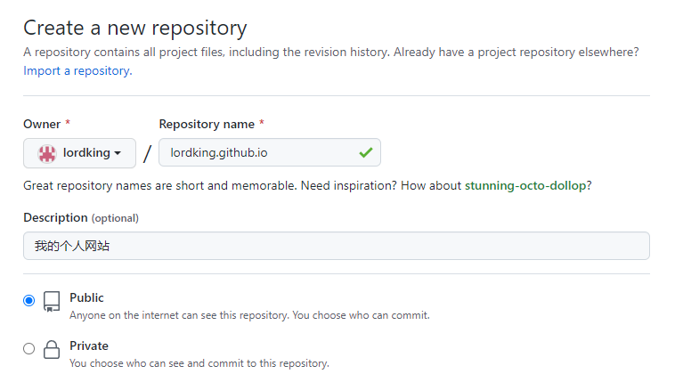
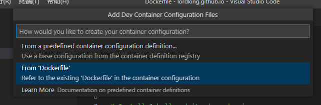
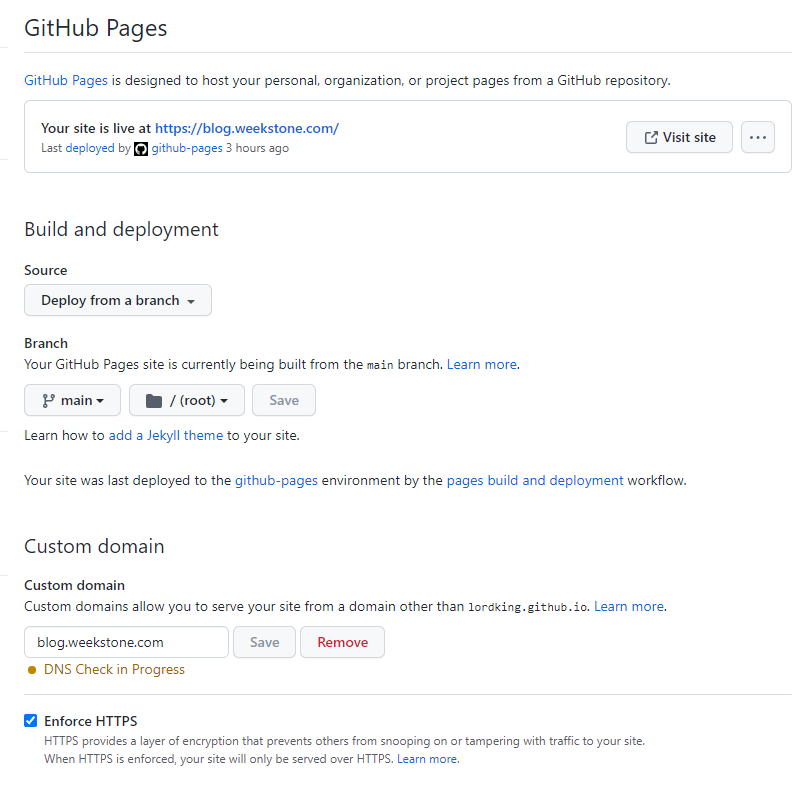

# 我的个人网站建设笔记

使用GitHub Page搭建我的个人网站。

## 1 创建网站

参考资料来源于：[https://pages.github.com/](https://pages.github.com/)

### 1.1 在Github创建仓库

在GitHub创建一个新的公开仓库（`public repository`），创建时注意命名为username.github.io，username是你在GitHub的用户名称。例如我的用户名是`lordking`，那么我的个人网站就是`lordking.github.io`。为了描述方便，后面内容都以我的个人网站作为例子。



仓库创建成功后，即代表着你已经在GitHub创建了一个免费个人网站，接下来就是要放上你的网站内容。

### 1.2 克隆仓库到本地

```shell
git clone git@github.com:lordking/lordking.github.io.git
```

或者，你也可以下载[Github Desktop](https://desktop.github.com/)，克隆你的仓库到本地

或者，你可以指定一个目录

```
git init
git branch -M main
git remote add origin git@github.com:lordking/lordking.github.io.git
```

### 1.3 第一个`Hello World`网页

```
echo "Hello World" > index.html

git add --all
git commit -m "初始提交"
git push -u origin main
```

打开你的个人网站：`https://lordking.github.io/`

## 2 使用Docker安装开发环境

Jekyll是Github提供的静态网站引擎。本地安装它的目的是为了更方便地在本地编辑或者调试网站内容。

个人不建议原生安装，而是推荐使用`Docker`安装。原因是无论是Windows还是Mac，我们想要完整安装[Github指定版本的Ruby+Jekyll环境](https://pages.github.com/versions/)往往很困难，常常因为安装过程中遇到一些未知问题导致不得不大量地网上搜索资料以解决，很多时候尝试是失败的。除非你是传说中的极客，否则不建议尝试。

### 2.1 提前准备

- 安装在Windows或者Mac上的`Docker`
- `Visual Studio Code`
- `Visual Studio Code`上已经安装微软提供的`Docker`插件

### 2.2 创建Docker镜像配置文件

1. 使用`Visual Studio Code`打开本地仓库所在的文件夹，如上例，文件夹名是`lordking.github.io`

2. 创建一个文件，命名为`Dockerfile`。写入如下内容

```
FROM ruby:2.7-alpine

# 添加我们所需要的依赖到Alpine
RUN apk update
RUN apk add --no-cache build-base gcc cmake git

# 安装Jekyll，目前github支持的最新版本是3.9.2
RUN gem update bundler && gem install jekyll:3.9.2

# 设置一个工作目录
RUN mkdir -p /usr/src/app
WORKDIR /usr/src/app
```

### 2.3 生成并运行`Docker`镜像

1. 在`Visual Studio Code`输入`Shift+Command+P`（Mac）或者`Shift+Ctrl+P`（Windows）调出命令行，输入如下指令，然后回车。

```
Dev Containers: Open Folder in Container...
```

回车后，将打开对话框`选择文件夹`，选择当前文件夹`lordking.github.io`。

点击确定后将出现如下对话框，选择第二个选项`From Dockerfile`



如果成功，将会运行镜像名的开头为`vsc-`的容器

2. 在`VSCode`新建终端，进入运行镜像容器的命令行

```bash
ruby -v 

jekyll -v
```

这时候，我们可以使用Jekyll在本地定制一个个人网站了。

## 3 使用Jekyll创建并运行网站

1. 输入下面指令初始化项目，将自动生成`Gemfile`配置文件，该配置文件用于配置依赖库。
```bash
bundle init
```

2. 输入下面指令，将添加将安装依赖库`jekyll 3.9.2`，并把`jekyll 3.9.2`的配置添加到`Gemfile`中
```bash
bundle add jekyll --version "~>3.9.2"
```

3. 输入下面指令，将生成一个新的网站。
```bash
bundle exec jekyll new --force --skip-bundle .
```

4. 输入下面指令，将读取`Gemfile`文件安装需要依赖的库。如果库已经安装成功，将不会重新安装。一般我们会使用这个指令检查依赖库是否正确安装，如果没有安装将会帮助我们安装
```bash
bundle install
```

4. 输入下面指令，运行Jekyll 服务。
```bash
bundle exec jekyll serve --livereload
```

打开网页后，我们会发现之前的`Hello World`依然还在。没有关系，把`index.html`文件删除掉就可以了。

## 4 配置主题

访问网站[https://rubygems.org/](https://rubygems.org/)，输入关键词`jekyll theme`搜索个人满意的主题。这里我选择了`bulma-clean-theme`。

修改`Gemfile`文件，添加选择的主题。
```yml
# Removed minima theme as it is a regular theme
# gem "minima", "~> 2.5"
gem 'bulma-clean-theme', '~> 0.13.1'
```

修改`_config.yml`文件，设置选择的主题
```yml
theme: bulma-clean-theme
```

安装主题
```
bundle update
```

运行网站
```bash
bundle exec jekyll serve --livereload
```


这时候打开浏览器是会发现一片空白。没什么别的原因，必须要根据主题的操作说明配置自己的网站。

## 5 配置网站

访问网站：`https://jamstackthemes.dev/demo/theme/bulma-clean-theme/`，根据网站上的说明配置自己的网站。

`_config.yml`

## 6 其他配置项
### 6.1 配置域名

1. 进入你创建的仓库，如上例：`https://github.com/lordking/lordking.github.io`
2. 打开`Settings`
3. 点击`Pages`，输入如下类型配置



```
docker build . -t lordking/github-page
```


修改`.devcontainer/devcontainer.json`
```
forwardPorts
```
