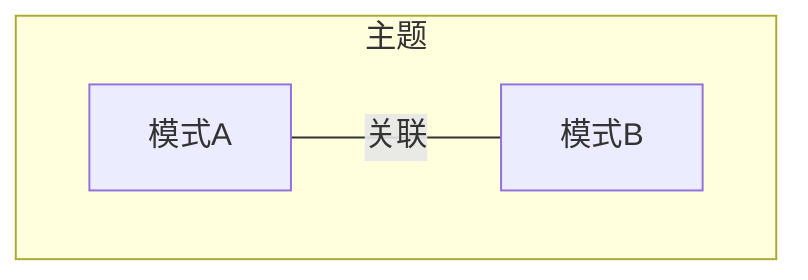
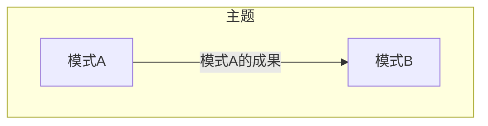
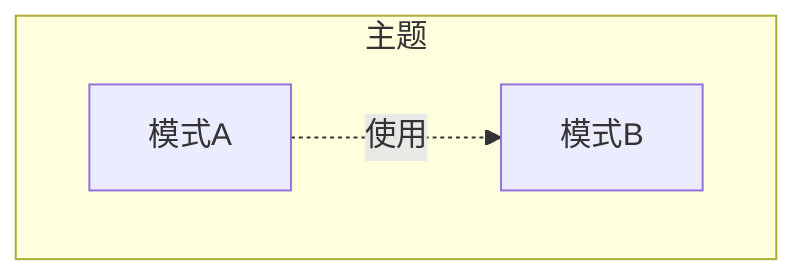
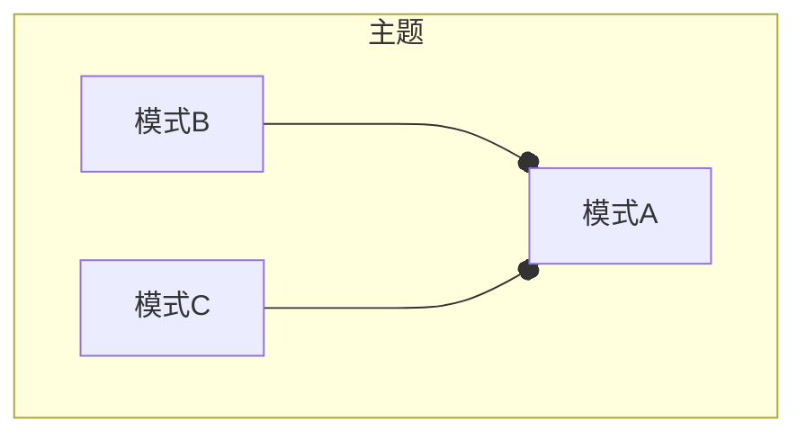
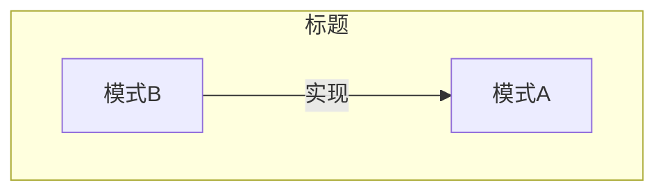

# 各行其道 SeparateWay

## 1 参考资料

>给出具体的参考书籍和引用链接。如果书籍有购买地址或在线阅读地址，给出具体链接地址。如果是书中某一章节，必须标明是哪个章节。且如果书籍存在在线阅读的链接，应给出对应章节的具体链接地址。
>
> - 名称(链接)

这里填写...

## 2 什么是各行其道

> 有关该名词的定义。
> 
> 名词（English name），....具体概念描述....

各行其道（SeparateWay）描述了一种情况，使用各种通用语言来与一个或多个限界上下文集成这样的方式不能产生显著的回报。也许你所寻求的功能并不能由任何一种通用语言提供。在这种情况下，只能在限界上下文中创造属于自己的特殊解决方案，并放弃针对这种特殊情况的集成。

## 3 影响（必须）

> 描述使用该模式产生的影响，可能是正面积极的影响，有时同时会存在负面的影响。

这里填写...

## 4 上下文
> 以图形方式描述当前模式与其他模式之间的关系

- 关联

​	描述模式A与其他相关模式，如模式B存在关联关系。一般会用在当谈到模式A的时候，共同出现模式B等其他模式的概念，此时它们将共同解决某一主题范围内的问题。

- 输入

​	运用模式A的成果，作为模式B的输入。一般认为模式B是模式A的下一个步骤

- 使用

​	模式A在方案中使用到模式B

- 组合

​	模式B和模式C共同组成模式A

- 实现

​	模式A可以使用模式B实现

## 5 应用指南

> 描述使用该模式过程中需要注意的提示要点，或出现的常见问题及其对应的解决方案。

各行其道意味着两个上下文之间根本没有关系，不需要控制，也不需要承诺。在一个复杂的模型中，一定存在着许多上下文，而大部分上下文之间应该是没有直接依赖关系的。

如果任何两个上下文之间都有直接联系，整个模型就要走向另一个极端：大泥球。两个上下文之间没有任何依赖，自由地独立演进，这应该是我们最希望的。因此，在可能的情况下，我们应该把两个上下文分开，让它们各行其道。

## 6 样例（必须）

> 描述具体实践的样例，其中包含代码、具体方案。

这里填写...

## 7 批注

> 学习过程的思考笔记

这里填写...

