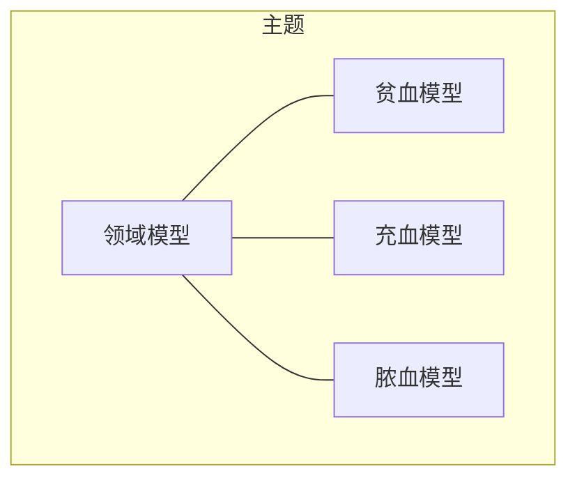
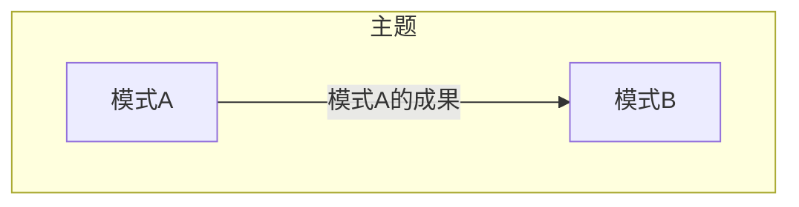
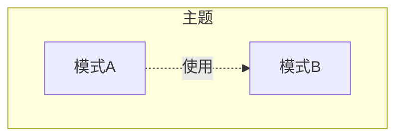
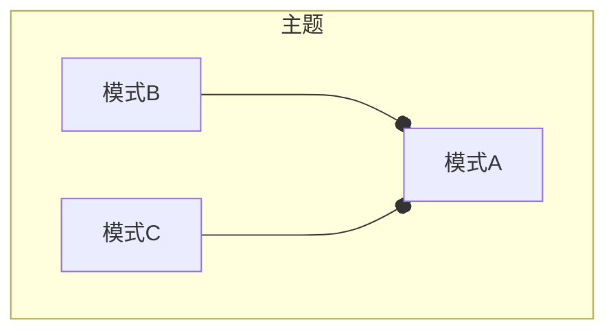
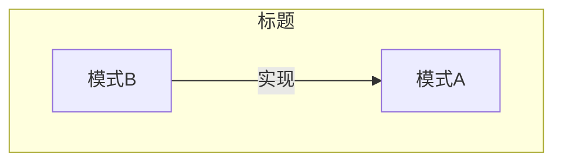

# 领域模型 Domain Model

## 1 参考资料

>给出具体的参考书籍和引用链接。如果书籍有购买地址或在线阅读地址，给出具体链接地址。如果是书中某一章节，必须标明是哪个章节。且如果书籍存在在线阅读的链接，应给出对应章节的具体链接地址。
>
> - 名称(链接)

- 《领域驱动设计》-运用领域模型
- 《Domain-Driven Design Reference》-定义

## 2 什么是领域模型

> 有关该名词的定义。
> 
> 名词（English name），....具体概念描述....

领域模型是关于某个特定业务领域的软件模型。通常，领域模型通过对象模型来实现，这些对象同时包含了数据和行为，并且表达了准确的业务含义。

领域模型把通用语言表达成软件模型。

领域模型，是指为解决领域相关的特定问题，对领域内知识进行严格且有选择的抽象。

领域模型不是要尽可能建立一个与“现实”符合的模型，或是对某种事物的数字化模拟。而是要为了解决领域内特定问题，对领域内的知识有意的结构化和有选择的简化。

## 3 影响（必须）

> 描述使用该模式产生的影响，可能是正面积极的影响，有时同时会存在负面的影响。

任何领域内盘大而复杂的知识，常常令人望而生畏，其内在的信息量可能超乎想象。适当的领域模型可以帮助我们专注于问题。

领域模型在领域驱动设计的作用：

## 4 上下文
> 以图形方式描述当前模式与其他模式之间的关系

- 关联

​	描述模式A与其他相关模式，如模式B存在关联关系。一般会用在当谈到模式A的时候，共同出现模式B等其他模式的概念，此时它们将共同解决某一主题范围内的问题。

- 输入

​	运用模式A的成果，作为模式B的输入。一般认为模式B是模式A的下一个步骤

- 使用

​	模式A在方案中使用到模式B

- 组合

​	模式B和模式C共同组成模式A

- 实现

​	模式A可以使用模式B实现

## 5 应用指南

> 描述使用该模式过程中需要注意的提示要点，或出现的常见问题及其对应的解决方案。

- 警惕滑进大泥球

	当团队在讨论各种各样的概念时，很可能越来越复杂。这时候，团队正在落入一种陷阱？他们已经偏离了最初的核心概念。不要因为命名概念过少而疑惑。对于每一个命名元素而言，我们都可能情不自禁地在脑海中闪现两个、三个或更多可以支撑它的概念。而此时项目才刚刚起步，团队就已经滑向大泥球的深渊。

- 警惕数据驱动设计的思维去设计领域模型

	领域驱动设计的核心是业务驱动，而非数据驱动。

- 警惕编码实现的惯性思维模式

	比如：这个概念应该设计怎样的关系型数据表，把这个概念设计成一个REST资源怎么样，这个概念需要使用一个抽象类来实现方便未来的扩展，等等。些是过往的经验、对某种技术的偏好或者组织规范的要求而导致的。需要注意的是，我们在进行战略设计时，一定要暂时搁置这些关于实现的技术细节。一方面，这时通用语言（概念和需求）依然在发展过程中，我们会不断地质疑并修正它们，过早地思考针对这些概念和需求的实现没有任何意义。另一方面，如果在现阶段的讨论中就提及这样一些专业的技术术语，只会对领域专家造成干扰，浪费掉和他们协作的宝贵时间。不用着急，我们会在战术设计阶段再来考虑这些关于实现的细节问题。

## 6 样例（必须）

> 描述具体实践的样例，其中包含代码、具体方案。

这里填写...

## 7 批注

> 学习过程的思考笔记

这里填写...
