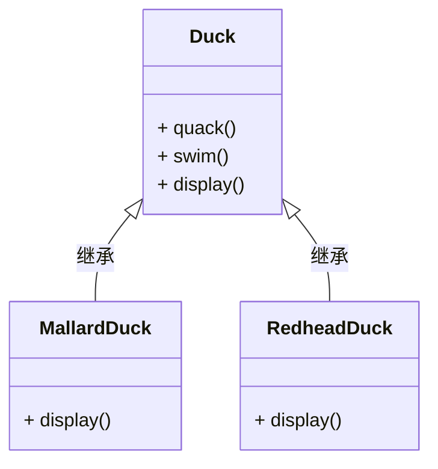

# Java设计模式

## 参考资料

- Hand First设计模式

## 1 为什么需要设计模式

**什么是设计模式**

“每一个模式描述了一个在我们周围不断重复发生的问题以及该问题的解决方案的核心。这样你就能一次又一次地使用该方案而不必做重复劳动。”——《设计模式：可复用面向对象软件的基础》

我们这里讲的设计模式是非常狭义的设计模式，指的是《设计模式：可复用面向对象软件的基础》所记载的设计模式，共有23个。这些设计模式都是基于面向对象编程范式，即封装、继承、多态三大原则而设计的。

**简单的继承**

