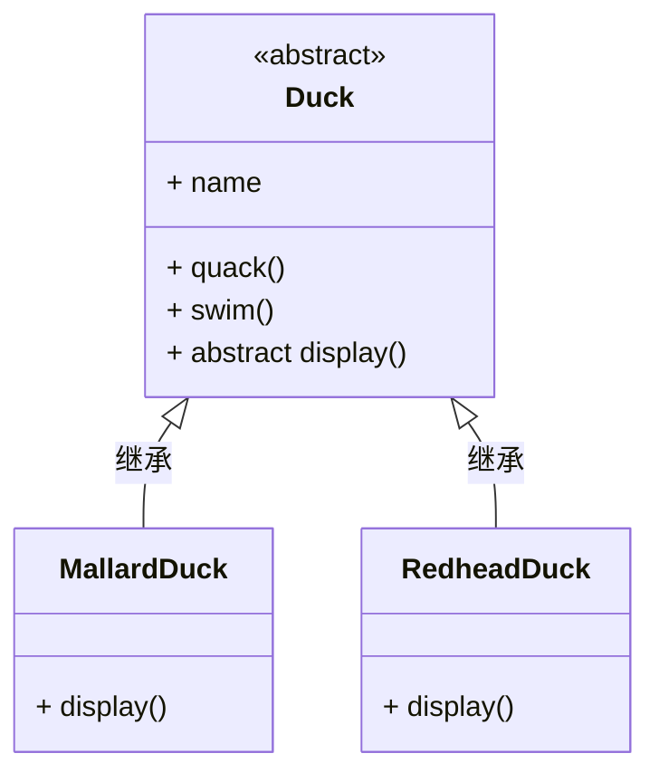
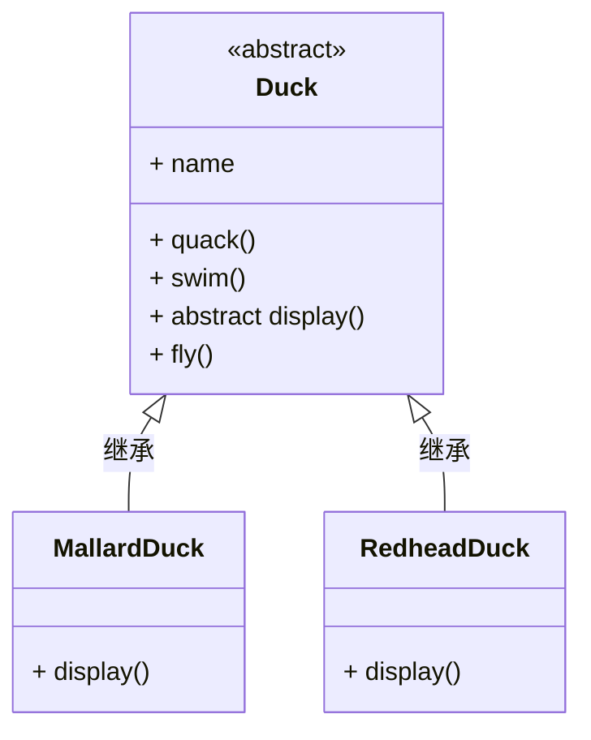
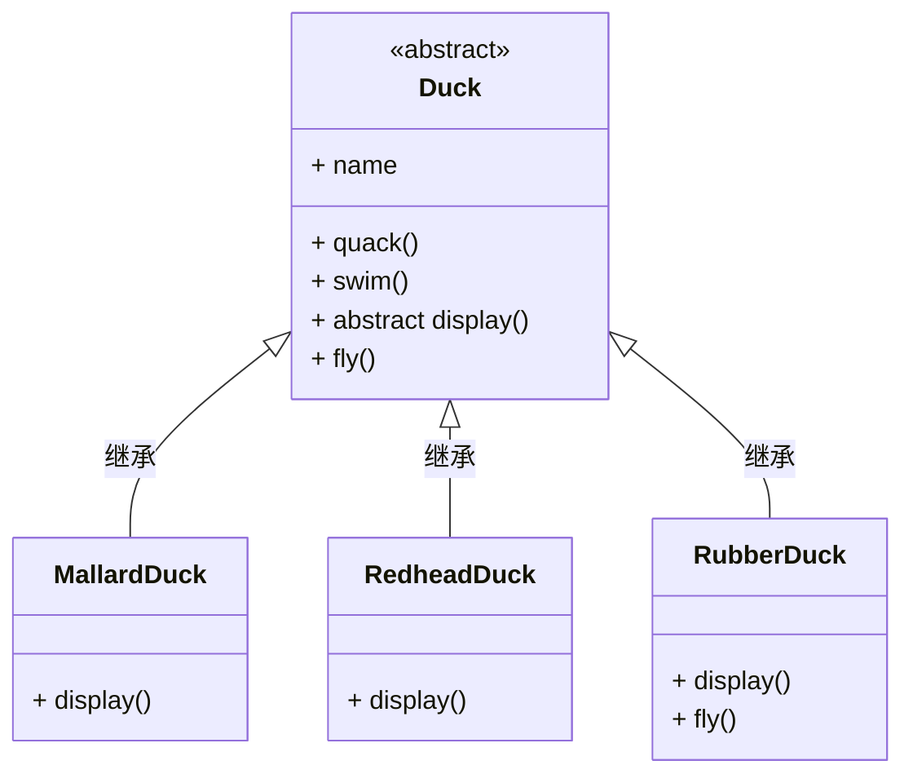
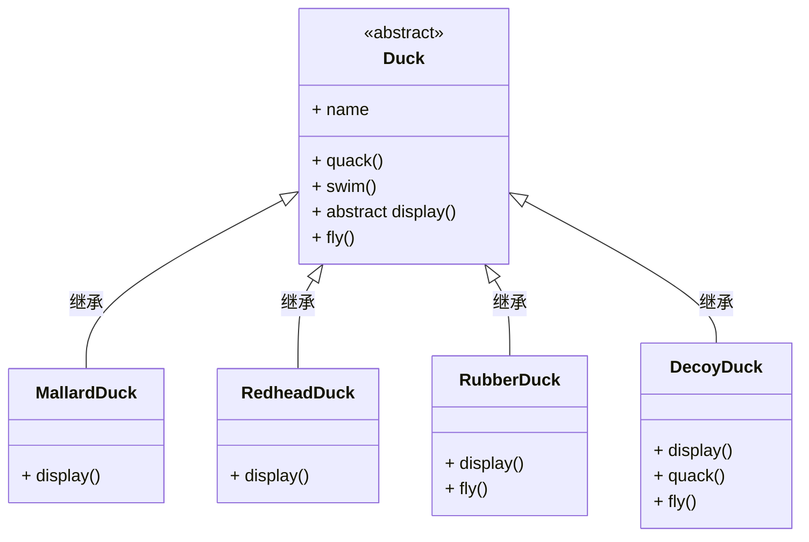
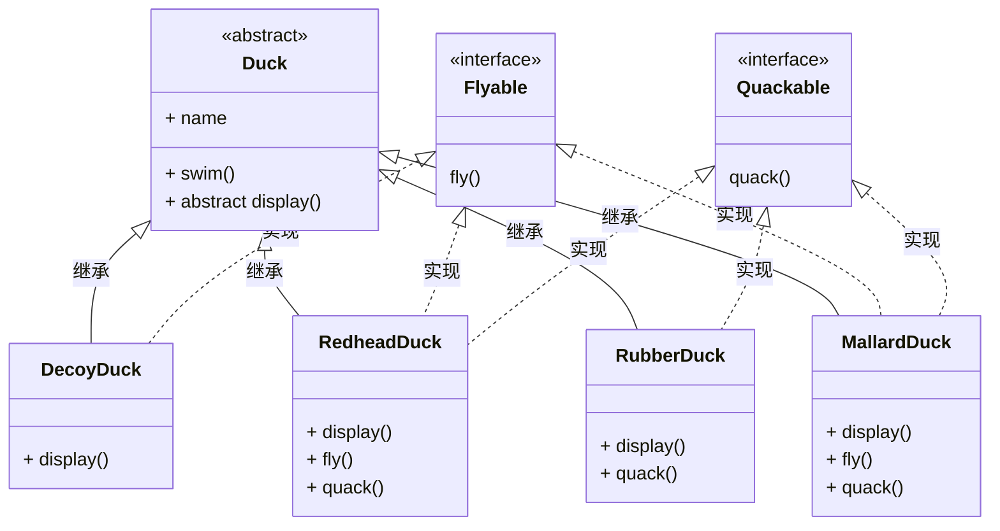
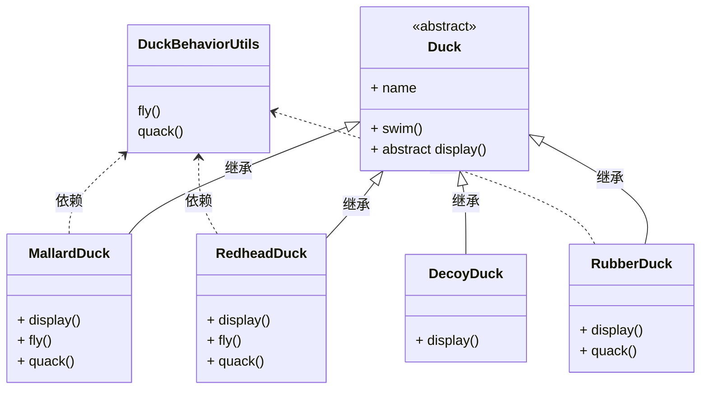

# Java设计模式

## 参考资料

- Hand First设计模式

## 1 为什么需要设计模式

### 什么是设计模式

“每一个模式描述了一个在我们周围不断重复发生的问题以及该问题的解决方案的核心。这样你就能一次又一次地使用该方案而不必做重复劳动。”——《设计模式：可复用面向对象软件的基础》

我们这里讲的设计模式是非常狭义的设计模式，指的是《设计模式：可复用面向对象软件的基础》所记载的设计模式，共有23个。这些设计模式都是基于面向对象编程范式，即封装、继承、多态三大原则而设计的。

### 继承实现的可复用

超类鸭子`Duck`实现了所有鸭子共同的行为`quack()`、`swim()`，并定义了抽象方法`display()`。**继承**超类的子类型鸭子实现了自己不同的外观行为`display()`。

我们**增加了一个新的行为**`fly()`，那么所有类型的鸭子都有了这个新的行为。到现在为止，结果很美好——我们通过继承实现了**可复用**。

我们继续增加了一个新的鸭子类型——橡皮鸭。橡皮鸭不会飞。我们在新的子类鸭子（RubberDuck）中通过重载覆盖超类型的鸭子行为`fly()`，以实现该需求。

我们继续再次增加一个新的鸭子类型——诱饵鸭。诱饵鸭不会飞、不会叫。这时我们只能继续重复上次的方法。

**继承不是答案**

- 由于子类鸭子很难知道超类鸭子的全部行为。当有新的鸭子类型出现，就在超类中检查是否存在重复的鸭子行为。
- 为了隐藏不需要的行为，不得不在多个子类鸭子中编写重复的代码，覆盖超类鸭子的行为。这样的做法，实际上已经违反了DRY原则。

[源代码参考：继承实现的可复用](https://github.com/lordking/learn-programming-with-coding/tree/main/java-design-pattern/src/main/java/com/weekstone/learn/design/pattern/start/idea1)

### 接口实现的可复用

把行为提取出来定义为接口，让子类鸭子选择自己的行为。

我们依然发现，这是一个糟糕的主意。在多个子类鸭子中间，我们又通过实现接口的方式重复实现了相同的行为。重复的代码，比上次更多了！！

### 工具类实现的可复用

有没有更糟糕的主意？一种反模式的实现——工具类。用一个工具类封装那些可能会被共享的行为，然后给其他的子类鸭子调用。这种做法，已经不再遵守面向对象的编程范式。将让我们陷入了更加复杂的技术实现。

### 设计模式解决的是什么？

软件是不是一成不变的？要了解这件事情，我们必须了解软件相对于硬件的价值。我们知道当硬件被生产出来交给用户使用之后，厂商是很难改变机器的工作行为。而软件不同，软件从诞生开始，我们就可以不断地升级改变机器的工作行为。为了达到这个目的，软件应该很容易被修改。当需求发生变化的时候，随之所需的软件变更必须可以简单而方便地实现。

设计模式解决的问题就是更好地实现变化这一特性。我们发现几乎绝大部分软件系统当不断变更需求以后，变更的成本变得越来越高。这种情况迫使我们不得不从软件工程的各个方面考虑如何降低变更成本。设计模式是其中之一的重要解决手段。如同上面发生的三个案例，当变化出现的时候，我们需要找到更好的手段处理变化。显而易见，上面的三种案例所体现的三种手段都失败了。

幸运的是，我们找到了一个设计原则，能够更好地修改某个行为。

**我们找到可能发生变化的部分，单独取出并封装起来，以便在未来某个时候轻易改变它们。而让不会发生变化的部分不受到影响。**

再次记住，设计模式是解决可能变化的代码，而不是解决不会变化的代码。我们需要封装可能变化的代码，而不是不会变化的代码。

### 设计模式的局限性

当我们掌握了每种设计模式的实现，我们需要在实践中找到正确使用它们的地方。程序员大多掌握多个设计模式，却往往在错误的地方错误地使用了某个设计模式。即使有着丰富开发经验的程序员，也可能在不适当的地方使用了某个设计模式。新手程序员往往喜欢到处尝试不同的设计模式，最后导致了更加复杂难以维护的程序代码。因为只有很少的程序员熟练地背诵每个设计模式的适用场景。

我们谈的23种设计模式只是所有设计模式的冰山一角。它们只适用于局部性的代码。

我们对变化的预测有可能是错误的。如果发生了错误的预测，变动将在不会变化的部分发生，那么任何设计模式也无法解决这种情况。

### 从哪里开始？

