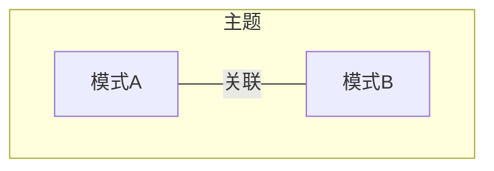
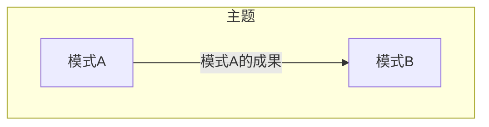
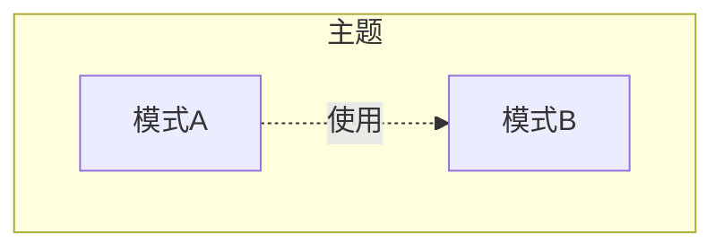
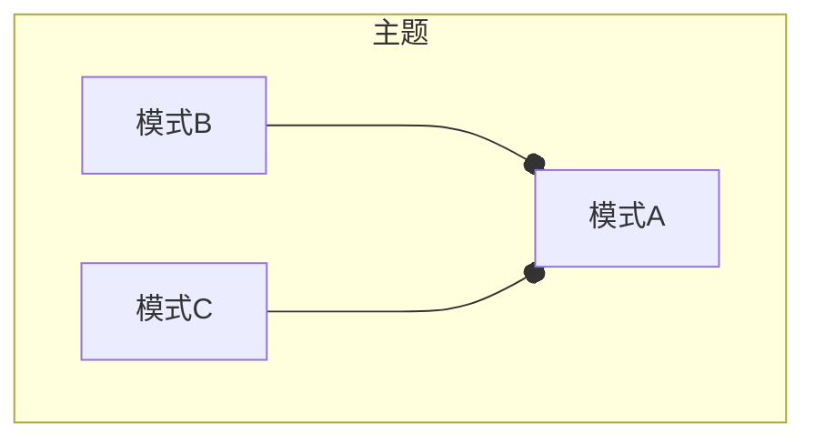
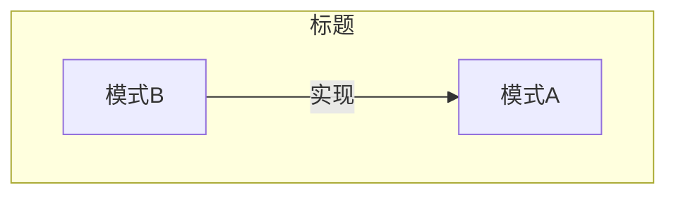
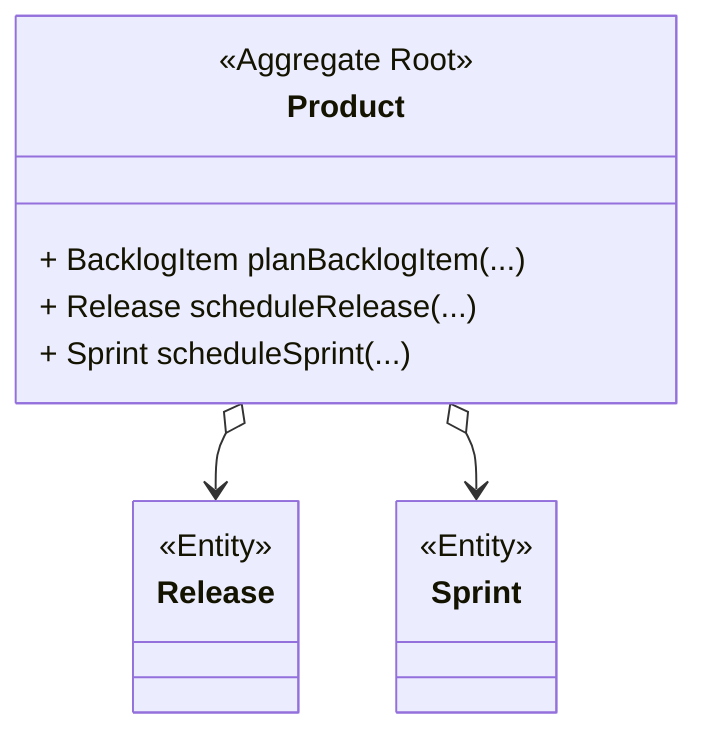

# 工厂 Factory

## 1 参考资料

>给出具体的参考书籍和引用链接。如果书籍有购买地址或在线阅读地址，给出具体链接地址。如果是书中某一章节，必须标明是哪个章节。且如果书籍存在在线阅读的链接，应给出对应章节的具体链接地址。
>
> - 名称(链接)

这里填写...

## 2 什么是[名词]（必须）

> 有关该名词的定义。
> 
> 名词（English name），....具体概念描述....

这里填写...

## 3 影响（必须）

> 描述使用该模式产生的影响，可能是正面积极的影响，有时同时会存在负面的影响。

这里填写...

## 4 上下文
> 以图形方式描述当前模式与其他模式之间的关系

- 关联

​	描述模式A与其他相关模式，如模式B存在关联关系。一般会用在当谈到模式A的时候，共同出现模式B等其他模式的概念，此时它们将共同解决某一主题范围内的问题。



- 输入

​	运用模式A的成果，作为模式B的输入。一般认为模式B是模式A的下一个步骤



- 使用

​	模式A在方案中使用到模式B



- 组合

​	模式B和模式C共同组成模式A



- 实现

​	模式A可以使用模式B实现



## 5 应用指南

> 描述使用该模式过程中需要注意的提示要点，或出现的常见问题及其对应的解决方案。

使用工厂模式创建领域对象

- 当领域聚合A需要访问领域聚合B时，就可以在A中使用工厂模式创建B的对象
- 领域聚合内部存在复杂的业务规则时，就需要工厂模式

常用的工厂设计模式包含

- 简单工厂
- 工厂方法 Factory Method
- 抽象工厂 Abstract Factory
- 创建者模式 Builder

### 领域模型中的工厂方法

除了创建对象之外，工厂并不需要承担领域模型中的其他职责

封装了所有创建对象的复杂操作过程，同时，它并不需要客户去引用那个实际被创建的对象。

### 聚合根中的工厂方法

对于聚合来说，我们应该一次性地创建整个聚合，并且确保它的不变条件得到满足。

在聚合根中实现用于创建**子实体对象**的工厂方法。如下示例：



虽然在实际代码中通过ProductId已经拆解了上面大的聚合逻辑，但是在聚合根中提供了创建子实体的工厂方法。

```java
public Product extends Entity {
	...
	public BacklogItem planBacklogItem(
            BacklogItemId aNewBacklogItemId,
            String aSummary,
            String aCategory,
            BacklogItemType aType,
            StoryPoints aStoryPoints) {

        BacklogItem backlogItem =
            new BacklogItem(
                    this.tenantId(),
                    this.productId(),
                    aNewBacklogItemId,
                    aSummary,
                    aCategory,
                    aType,
                    BacklogItemStatus.PLANNED,
                    aStoryPoints);

        DomainEventPublisher
            .instance()
            .publish(new ProductBacklogItemPlanned(
                    backlogItem.tenantId(),
                    backlogItem.productId(),
                    backlogItem.backlogItemId(),
                    backlogItem.summary(),
                    backlogItem.category(),
                    backlogItem.type(),
                    backlogItem.storyPoints()));

        return backlogItem;
    }
}
```

### 领域服务中的工厂

在集成限界上下文中，领域服务（7）扮演了工厂的角色，它用于创建不同类型的聚合和值对象。

使用工厂模式实现了两个上下文的通用语言翻译

- 在领域模型中，领域服务类负责把其他上下文的对象翻译成当前业务领域中上下文的对象。此时的领域服务实际上扮演了工厂的角色，采用的是抽象工厂的设计模式。

```java
// 该领域服务类将身份与访问上下文中的对象翻译成协作上下文中的对象。
package com.saasovation.collaboration.domain.model.collaborator;

import com.saasovation.collaboration.domain.model.tenant.Tenant;

public interface CollaboratorService {

    public Author authorFrom(Tenant aTenant, String anIdentity);

    public Creator creatorFrom(Tenant aTenant, String anIdentity);

    public Moderator moderatorFrom(Tenant aTenant, String anIdentity);

    public Owner ownerFrom(Tenant aTenant, String anIdentity);

    public Participant participantFrom(Tenant aTenant, String anIdentity);
}
```

这里的对象是简单的值对象，它们都继承collaborator

```java
public abstract class Collaborator
        implements Comparable<Collaborator>, Serializable {

		...
}

public final class Author extends Collaborator { 
	...
}
```

委派给适配器层中某个实现类实现上下文的对象翻译工作

```java
package com.saasovation.collaboration.port.adapter.service;

public class TranslatingCollaboratorService implements CollaboratorService {

		...
		@Override
    public Author authorFrom(Tenant aTenant, String anIdentity) {
        Author author =
                this.userInRoleAdapter()
                    .toCollaborator(
                            aTenant,
                            anIdentity,
                            "Author",
                            Author.class);

        return author;
    }
		...
}
```

定义被创建对象的抽象类型

```java
package com.saasovation.collaboration.port.adapter.service;

public interface UserInRoleAdapter {

    public <T extends Collaborator> T toCollaborator(
            Tenant aTenant,
            String anIdentity,
            String aRoleName,
            Class<T> aCollaboratorClass);
}
```

实现被创建对象

```java
package com.saasovation.collaboration.port.adapter.service;

public class HttpUserInRoleAdapter implements UserInRoleAdapter {
   ...
}
```


## 6 样例（必须）

> 描述具体实践的样例，其中包含代码、具体方案。

这里填写...

## 7 批注

> 学习过程的思考笔记

这里填写...
