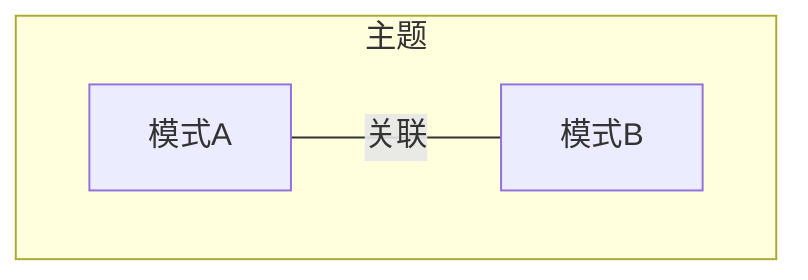
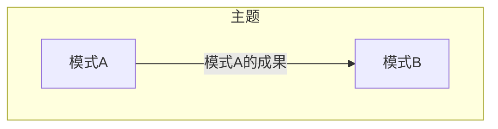
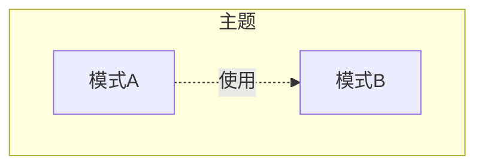
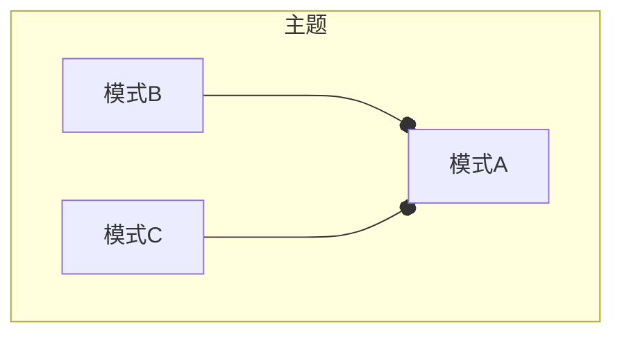
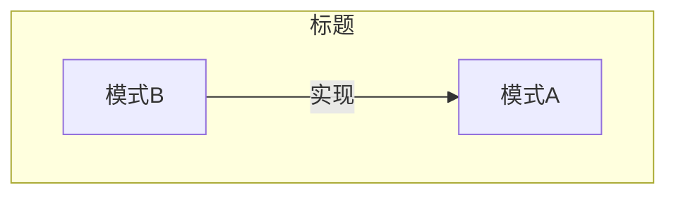

# 模式语言中文名称 Englishi Name

## 1 参考资料

>给出具体的参考书籍和引用链接。如果书籍有购买地址或在线阅读地址，给出具体链接地址。如果是书中某一章节，必须标明是哪个章节。且如果书籍存在在线阅读的链接，应给出对应章节的具体链接地址。
>
> - 名称(链接)

- [《领域驱动设计精粹-第5章 运用聚合进行战术设计》
](https://weread.qq.com/web/reader/e963250072021a5ce9608a6k182326e0221182be0c5ca23)

## 2 什么是实体 Entity

> 有关该名词的定义。
> 
> 名词（English name），....具体概念描述....

一个实体模型就是一个独立的事物。每个实体都拥有一个唯一的标识符，可以将它的个体性和所有其他类型相同或者不同的实体区分开。许多时候，也许应该说绝大多数时候，实体是可变的。也就是说，它的状态会随着时间发生变化。不过，一个实体不一定必须是可变的，它也可能是不可变的。将实体与其他建模工具区分开的主要因素是它的唯一性——即它的个体性。

## 3 影响（必须）

> 描述使用该模式产生的影响，可能是正面积极的影响，有时同时会存在负面的影响。

这里填写...

## 4 上下文
> 以图形方式描述当前模式与其他模式之间的关系

- 关联

​	描述模式A与其他相关模式，如模式B存在关联关系。一般会用在当谈到模式A的时候，共同出现模式B等其他模式的概念，此时它们将共同解决某一主题范围内的问题。

- 输入

​	运用模式A的成果，作为模式B的输入。一般认为模式B是模式A的下一个步骤

- 使用

​	模式A在方案中使用到模式B

- 组合

​	模式B和模式C共同组成模式A

- 实现

​	模式A可以使用模式B实现

## 5 应用指南

> 描述使用该模式过程中需要注意的提示要点，或出现的常见问题及其对应的解决方案。

实体ID，不应该跟随在创建实体后才返回，由数据库持久机制生成。这样会导致无法在异步情况下测试其结果。

## 6 样例（必须）

> 描述具体实践的样例，其中包含代码、具体方案。

这里填写...

## 7 批注

> 学习过程的思考笔记

这里填写...