# 聚合 Aggregate

## 1 参考资料

>给出具体的参考书籍和引用链接。如果书籍有购买地址或在线阅读地址，给出具体链接地址。如果是书中某一章节，必须标明是哪个章节。且如果书籍存在在线阅读的链接，应给出对应章节的具体链接地址。
>
> - 名称(链接)

- [实现领域驱动设计 - 第10章 聚合](https://weread.qq.com/web/reader/f5032ce071fd5a64f50b0f6kad63251024aad61ab143c7e)
- [领域驱动设计精粹 - 第5章 运用聚合进行战术设计](https://weread.qq.com/web/reader/e963250072021a5ce9608a6ke3632bd0222e369853df322)

## 2 什么是聚合

> 有关该名词的定义。
> 
> 名词（English name），....具体概念描述....

聚合，是由一个或多个[[实体]]组成，还可能包括值对象。聚合中一个实体被称为聚合根（AggregateRoot），聚合根控制着所有聚会在其中的其他元素，根实体名称就是聚合概念上的名称。

![[聚合图例1.png]]


## 3 影响（必须）

> 描述使用该模式产生的影响，可能是正面积极的影响，有时同时会存在负面的影响。

这里填写...

## 4 上下文
> 以图形方式描述当前模式与其他模式之间的关系

- 关联

​	描述模式A与其他相关模式，如模式B存在关联关系。一般会用在当谈到模式A的时候，共同出现模式B等其他模式的概念，此时它们将共同解决某一主题范围内的问题。

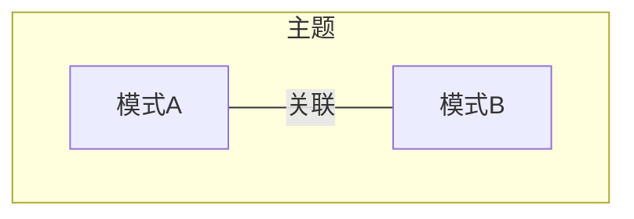

- 输入

​	运用模式A的成果，作为模式B的输入。一般认为模式B是模式A的下一个步骤

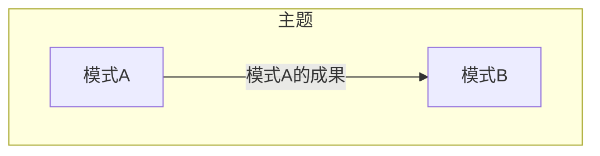

- 设计聚合所使用到的模式语言

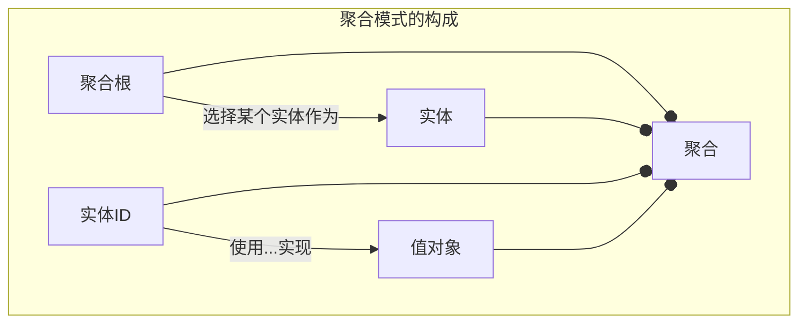

- 实现

​	模式A可以使用模式B实现

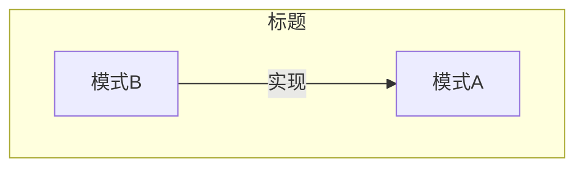

## 5 应用指南

> 描述使用该模式过程中需要注意的提示要点，或出现的常见问题及其对应的解决方案。

### 聚合的建模规则

#### 规则1：在一致性边界之内建模真正的不变条件

##### 规则含义

- 聚合的组成部分应该由不变条件决定，即业务规则决定什么样的实体或值对象可以放在一个聚合中。
- 不变条件同时决定了一次事物提交中必须保存一致的内容。

##### 不变条件是指不变的业务规则

不变条件是指聚合边界之内的所有内容组成了一套不变的业务规则，任何操作都不能违背这些规则。边界之外的任何东西与该聚合都是不相关的。

##### 事务隔离了聚合的修改

- **聚合表达了事务一致性边界相同的意思**
	每个聚合都会形成保证事务一致性的边界。这意味着在一个单独的聚合中，在控制被提交给数据库的事务时，它的所有组成部分必须根据业务规则保持一致。通常我们使用单个事务来管理一致性，在提交事务时，边界之内的所有内容都必须保持一致。对于一个设计良好的聚合来说，无论由于何种业务需求而发生改变，在单个事务中，聚合中的所有不变条件都是一致的。无论在哪种情况下，它都能保证在一个事务中只修改一个聚合实例。
  
- **事务边界由商业上的业务规则决定，而非技术因素决定。**
	
	因为任何时候都是业务来决定对象集的有效状态应该是什么。换句话说，如果聚合没有保存在一个完整有效的状态中，那么根据业务规则所执行的业务操作会被认为是错误的。业务规则才是驱动力，最终决定在单次事务完成提交后，哪些对象必须是完整、完全和一致的驱动力。

	向领域专家询问基于响应的更新可以等待多长时间，一般只有两种答案：即时发生或延时多久发生。对于即时发生的业务，应该把两个实体合并到一个聚合的边界之内；对于延迟发生的业务将是不同的聚合。

- “事务”隔离了对聚合的修改以及保证业务不变性（即软件必须始终遵守的规则）
	在每一次业务操作中，无论是通过原子级的数据库事务还是其他方法来控制需求，聚合的状态或者它通过事件溯源方法表现出的形式，必须始终安全和正确地进行转移和维护，保持最终一致性。

#### 规则2：设计小聚合

##### 规则含义

每个聚合的内存占用空间和事务包含范围应该相对较小。

小聚合带来的好处

- 降低内存的需求，提升持久化存储加载的速度
- 可以增加事务的成功执行，即减少事务提交冲突的次数。
- 它还有助于强化不要在同一次事务中修改其他聚合实例的规则
- 仅使用标识符引用还有一个好处，就是聚合可以使用任何类型的持久化机制轻松地存储
- 更加容易测试。

##### 如何防止创建臃肿的聚合

维持一个庞大的聚合，会限制系统的性能和可伸缩性。

在设计聚合时还需要记住的是[[单一职责原则 SRP]]。如果你的聚合想做的事情太多，就违反了SRP。我们可以通过思考变化的原因，来去思考如何设计一个聚合。


聚合模式讨论的是对象组合和信息隐藏，这是团队成员们已经知道的。此外，聚合模式还包含了一致性边界和事务

聚合在概念上是比较清晰，但完全映射到实现时却不实用。原因是在并发情况下下会增加事务处理的难度，常常会出现事务失败的情况。当我们使用乐观锁避免多个客户端同时更改同一个聚合时，常常碰到多个客户端仅仅修改某个`子实体`（BlaklogItem、Release、Spring），却导致更大的`聚合根实体`（Product）因多人并行处理常常客户端提交失败。除了事务问题，这种设计还会影响到系统的性能和可伸缩性。

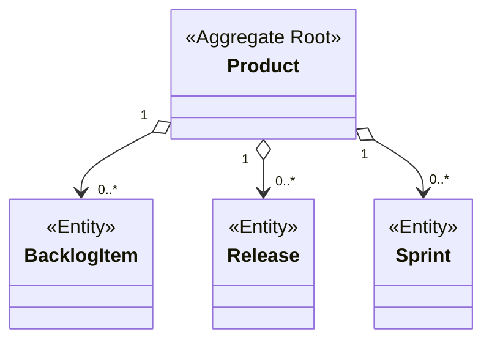

使用聚合ID分离更小的聚合，将会更有用

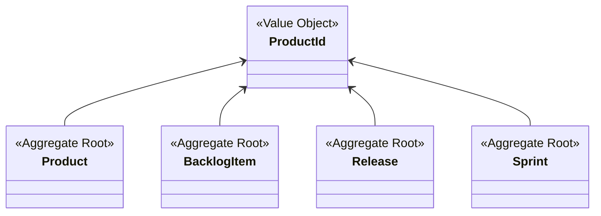

同时，原有的聚合根Product扮演工厂角色，用于创建其他聚合实例

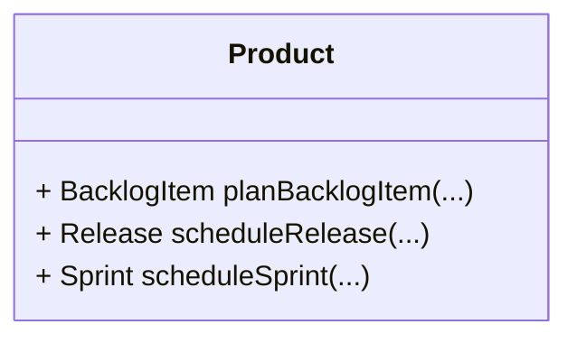

应用层将变成

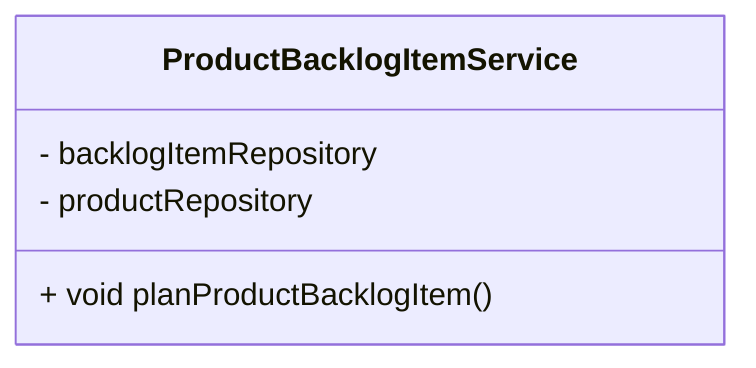

##### 拆散后的大聚合

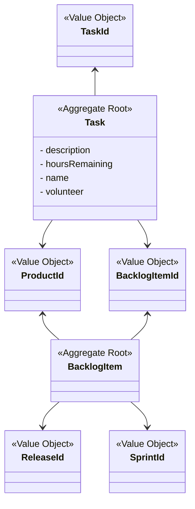


#### 原则3：只能通过标识引用其他聚合

- 每个聚合根必须拥有一个全局的唯一标识，全局唯一标识不等于委派标识（参考：[[层超类型 Layer Supertype]]），它是用于标识领域模型的唯一标识。

- 当一个聚合引用另一个聚合的根聚合时，不应该把被引用的聚合放在引用聚合的一致性边界之内。 

我们不应该写成如下类似的模型，直接关联另一个聚合。

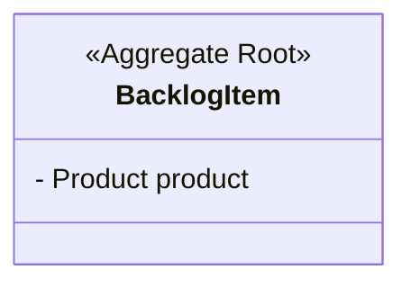
应该优先考虑通过全局唯一标识来引用

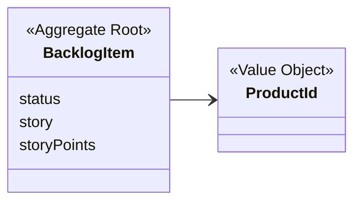

- 不管使用哪种方式在一个聚合中引用另外的聚合，我们都不能在同一个事务中修改多个聚合实例。
- 不要在聚合中，使用资源库，用于定位其他聚合。推荐的方式是，在应用服务中对此做出控制，然后分发给聚合。

#### 原则4：使用最终一致性更新其他聚会

如果单次用户请求需要修改多个聚合实例，而此时我们又需要保证模型的一致性时：使用最终一致性。通过领域事件支持最终一致性，即一个聚合的命令方法所发布的领域事件及时地发送给异步的订阅方。

领域专家通常是愿意接受那些有理由的延迟的——数秒钟、数分钟、数小时甚至数天的时间都是可以的。

如果发布者和订阅者位于同一个限界上下文中，没有必要使用重量级的消息中间件。

### 打破规则的理由

#### 理由1：方便用户界面

出于方便考虑，用户界面可能允许用户一次性地给多个对象定义共有的属性，然后再对它们进行批量处理。

#### 理由2：缺乏技术机制

如果项目中未采用消息、定时器、后台线程之类的技术。在这种情况下，我们可以考虑在单个事务中修改多个聚合实例。

#### 理由3：全局事务

团队中已经采用了全局的两阶段提交事务，短期内不可能消除。

#### 理由4：查询性能

有时，最好的方式还是在一个聚合中维护对其他聚合的直接引用，这有利于提高资源库的查询性能。


#### 优先使用值对象

我们应该尽量地将根实体所包含的其他聚合建模成值对象，而不是实体。在不至于对模型或基础设施造成明显影响的情况下，采用值对象全部替换的方式是最好的选择。

值对象具有不变性，可以减少状态的处理。

优先选择值对象，很多情况下实体的概念可以重构成值对象。值对象的优点是具有不变性，不会因时间改变而发生变化。

#### 使用迪米特法则

迪米特法则：强调了“最小知识”原则。考虑一个客户端对象需要调用系统中其他对象的行为方法的场景，此时我们可以将后者称为服务对象。

对迪米特法则做一个简单的总结：任何对象的任何方法只能调用以下对象中的方法：

（1）该对象自身，

（2）所传入的参数对象，

（3）它所创建的对象，

（4）自身所包含的其他对象，并且对那些对象有直接访问权。

### 使用“告诉而非询问”原则（Tell，Don‘t Ask）

对于客户端来说，这里的“非询问”表示：客户端对象不应该首先询问服务对象，然后根据询问结果调用服务对象中的方法，而是应该通过调用服务对象的公共接口的方式来“告诉”服务对象所要执行的操作。

#### 并发处理

我们需要考虑在何处放置乐观并发的版本号。在我们定义聚合时，最安全的方法便是只为根实体创建版本号。每次在聚合内部执行状态修改命令时，根实体的版本号都会随之增加。这样可以避免多个客户在同一个Product内部同时修改属性状态。

这样的目的是为了保障线程安全性。

使用层超类型定义实体对象

```java
public abstract class Entity extends AssertionConcern {

    private int concurrencyVersion;

    public Entity() {
        super();

        this.setConcurrencyVersion(0);
    }

    public int concurrencyVersion() {
        return this.concurrencyVersion;
    }

    private void setConcurrencyVersion(int aConcurrencyVersion) {
        this.concurrencyVersion = aConcurrencyVersion;
    }

		public void failWhenConcurrencyViolation(int aVersion) {
        if (aVersion != this.concurrencyVersion()) {
            throw new IllegalStateException(
                    "Concurrency Violation: Stale data detected. Entity was already modified.");
        }
    }
}
```

当在聚合中修改根实体的属性状态时，version属性就会增加

```java
public class Product extends Entity {
	...
	public void rename(...) {
		....
		this.version(this.version() + 1);
	}
	...
}
```

为每个实体创建版本号并不对所有的场景都适用，我们应尽量避免基础设施相关的因素来影响我们的建模决定。

#### 避免依赖注入

不要在聚合中注入资源库和领域服务，我们可以向应用服务中注入资源库和领域服务。

### 推迟决策持久化机制，避免数据驱动的思维

聚合应可以使用任何类型的持久化机制轻松地存储，包括关系型数据库、文档数据库，键值型存储以及数据网格/结构[2]。这意味着你可以选择 MySQL 关系型数据库表、PostgreSQL 或者 MongoDB 这样基于JSON 的存储，GemFire/Geode[3]，Coherence[4]，还有GigaSpaces[5]。

### 建立聚合模型

#### 要警惕几种错误建模的情况

- 贫血模型
- 把领域模型中的业务逻辑放到上层的应用服务中
- 将服务中的业务逻辑委托给帮助/工具类

#### 函数式编程如何实现

函数式编程范式宣扬数据和行为的分离，这与面向对象编程范式相反。在函数式编程中，数据要设计成不变的数据结构或者记录类型，而行为将被设计成操作特定类型不变记录的纯函数。

#### 慎重选择抽象级别

如果沿着通用语言的方向，你通常会建立合理的抽象。因为建模语言起码最初是由领域专家表达出来的，所以抽象建模会简单一些。尽管如此，有时候软件开发人员会过度热心于解决错误的问题，他们会建立过高的抽象级别。

当我们过度抽象带来过度设计，应思考以下问题：
- 软件模型的语言应匹配领域专家的心智模型
- 过高的抽象将付出比较高的研发成本，比如抽象后的通用方法难以解决某些具体且复杂的特殊问题，编写比实际需要更多的代码，可能殃及用户界面，对未来预判的需求被证明是失败的。

## 6 样例（必须）

> 描述具体实践的样例，其中包含代码、具体方案。


一个聚合的样例

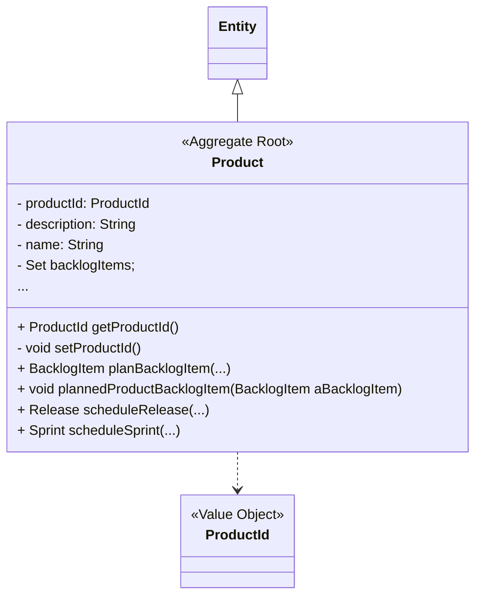

```java
class Product extends Entity {
  ProductId productId;
  String description;
  String name;
}
```

注意：
- 如果暴露了公有Setter方法，用来设置Product的值的逻辑可能会在模型之外实现，你应当承担对抗贫血领域模型的责任。
- 聚合根可以扮演工厂角色，用于创建实现子实体。
- 聚合根添加包含子对象的复杂操作。
- 运用DDD时，我们总是在一个限界上下文的范围内用通用语言进行建模。因此，Product聚合的所有部分都是按照通用语言来建模的。这些组成部分都不是凭空想象出来的，这一切都体现出领域专家与开发人员的合作无间。


## 7 批注

> 学习过程的思考笔记

这里填写...

