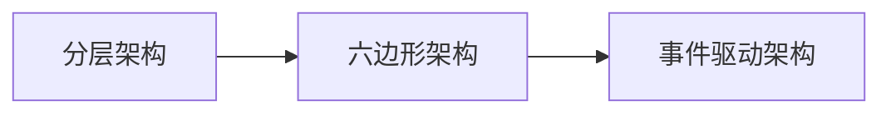

*内容正在准备中*

## 参考资料

- Scrum精髓：敏捷转型指南
- 领域驱动设计精髓
- 用户故事与敏捷开发

## DDD实践中的问题

- **把软件开发视为成本中心而非利润中心**
	在根生蒂固的商业文化下，认为软件投入是必须付出的消耗而不是战略优势。

- 开发人员热衷于挑战更高难度或者更新的技术方案
	并通过技术手段解决问题，而不是深入思考和设计，这会导致他们孜孜不倦地追逐技术上的新潮流。在工程实践中，研发人员常常习惯性地优先解决技术复杂性而掩盖业务复杂性，不去先分析业务模型之间的隔离，而去直接完成当前遇到的技术难题。当业务愈来愈复杂时，混乱且模糊不清的业务模型导致技术挑战越来越难以达成。

- 频繁而又要求精准的项目估算会占用大量的时间和精力，导致软件交付延期。开发人员使用“任务板挪卡”而非考虑周详的设计导致他们造出了一个个“大泥球[4]”（接下来的章节将会讨论），而不是业务驱动下恰当的分离模型。

- 过于重视数据库
	大多数解决方案的讨论都是围绕数据库和数据模型，而不是业务流程和运作方式。以数据驱动的视角分析软件架构，而非业务驱动分析软件架构。

- 对于根据业务目标命名的对象和操作，开发人员没有给予应有的重视，这导致他们交付的软件和业务所拥有的心智模型之间产生巨大的分歧。

- 项目中存在错误的抽象级别，表现为开发人员试图借助过度概括的方案满足所有当下以及臆想出来的未来需求，而不是解决实际而又具体的业务诉求。

- 在紧耦合服务群中，当一个服务执行操作时，该服务直接调用另一个服务并引发一个对等操作。这种耦合会经常破坏业务流程和未达成一致的数据，更别提这样的系统会有多难维护了。

## 敏捷软件开发

**Scrum最重要的信条：知识获取（Knowledge Acquisition）**

Scrum的开发方法更加强调将软件开发作为一种不断认知学习的过程，鼓励团队成员与业务人员之间持续地通过协作来迭代交付可工作的软件，并以此快速地获取用户反馈。当然知识获取并非“免费”，所以我们期望开发团队与业务人员之间通过一系列的设计研讨，并引入高效的协作工具（如DDD工具箱），帮助团队更加紧密和有效地进行知识传递与分享。

**有效设计**

管理层只会使用Scrum控制交付节奏，却对它最重要的信条之一：知识获取。

他们采用一种我称之为“任务板挪卡”[1]的方法来代替设计。团队有一个开发任务清单，比如Scrum[2]产品待办列表，其中的任务被张贴在“任务板”上，然后他们可以将一张便利贴从“任务板”上的“待办”泳道移动到“进行中”泳道，这就是“任务板挪卡”。产品经理提出待办项（任务），然后来一次“任务板挪卡”，这便构成了关于设计的全部“真知灼见”，剩下的就交给程序员大神们去疯狂输出代码。

频繁而又要求精准的项目估算会占用大量的时间和精力，导致软件交付延期。开发人员使用“任务板挪卡”而非考虑周详的设计导致他们造出了一个个“大泥球[4]”

优秀设计和有效设计并非由产品负责人或某个团队成员独立完成，而是通过他们之间不断的协作与交互，并在充分的知识获取后形成的，即协作设计。协作设计不是固定某个会议，而是提倡必要时随时随地进行。

**适度设计**

不做设计并不能节约成本，而过度设计也会造成浪费。敏捷开发不是轻视设计只注重实践和重构，而是鼓励演进式的设计（EvolutionaryDesign）。

优秀设计与有效设计是在持续的重构和迭代过程中产生的，每一次的设计优化都是从最大限度地满足客户的功能性需求和非功能性需求角度出发。

组织会将其确定为战略核心并对其长期投资。这将要求团队适度地进行有效设计，不仅要考虑到当下的交付规划，还要适当兼顾兼容性、可扩展性等未来的设计要求。这类模型则需要业务和开发人员充分地展开讨论与分析。

需要贯彻的软件设计方法原则
- 代码即文档
   - 贯彻**工作的软件** 高于 详尽的文档的敏捷开发原则
   - 尽量使用代码即文档的实践加快软件设计过程，以及减少设计文档与实际代码不能同步的问题。
   -  业务领域建模时，用代码对领域模型进行建模，推迟决策具体技术
- 测试驱动开发
- 响应变化
- 自治性
	自治性服务

**面向交付编写文档**

文档应成为开发领域模型的工具

不要为长期保持同步花费过长的时间

当心你在建模工作中对文字场景、图画、图表这些文档长期保持同步花费过长的时间。这些文档并不是领域模型。相反，它们只是帮助你开发领域模型的工具。模型终将与代码融为一体。

如本例所示，使用这种方法时，在验证代码的注释中维护文档形式的相关场景可能效果更好。如本例所示，使用这种方法时，在验证代码的注释中维护文档形式的相关场景可能效果更好。

## 测试驱动开发

我们可以简单地以“Given-When-Expect”的形式来创建测试，
1. Given先前的事件
	传入测试参数或领域服务的模拟Mock实现。

2. When调用聚合方法
	可以直接使用命令对象，将该命令对象传给当前被测试聚合所对应的应用服务。这使得我们将单元测试看作一种需求规范（specification），并且完全通过通用语言来表达这样的规范，而无论是采用代码还是DSL。

1. Expect以下事件或者一个异常
	将聚合产生的事件与所期望的事件进行比较。

- [单元测试驱动开发](%E5%8D%95%E5%85%83%E6%B5%8B%E8%AF%95%E9%A9%B1%E5%8A%A8%E5%BC%80%E5%8F%91)
- [行为驱动开发](%E8%A1%8C%E4%B8%BA%E9%A9%B1%E5%8A%A8%E5%BC%80%E5%8F%91)

  
## 重构

## 架构演进

大泥球Big Ball of Mud，这个词在Brian Foote和Joseph Yoder 1997年的同名文章中第一次出现，它是指杂乱无章、错综复杂、邋遢不堪、随意拼贴的大堆代码。众所周知，大泥球并非一日而成，开发人员最头痛的是它，对其避而远之，但每天滚动着的也是它。每一位开发人员都应该时刻保持警惕，不断地通过设计和实现的优化来杜绝或延缓大泥球的形成。

## DDD与TOGAF