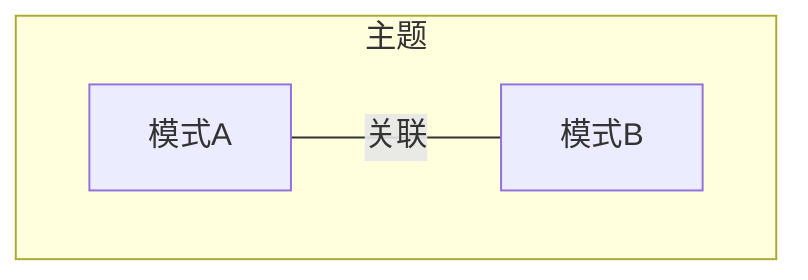
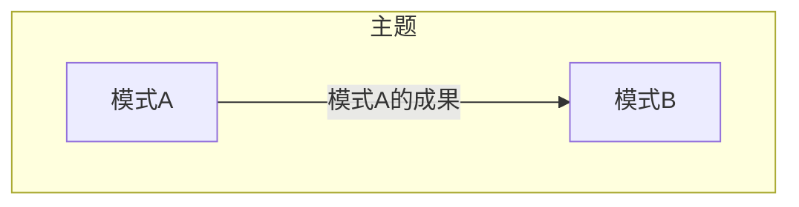
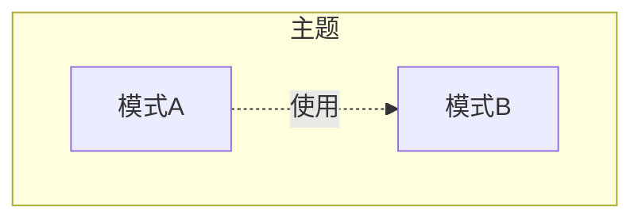
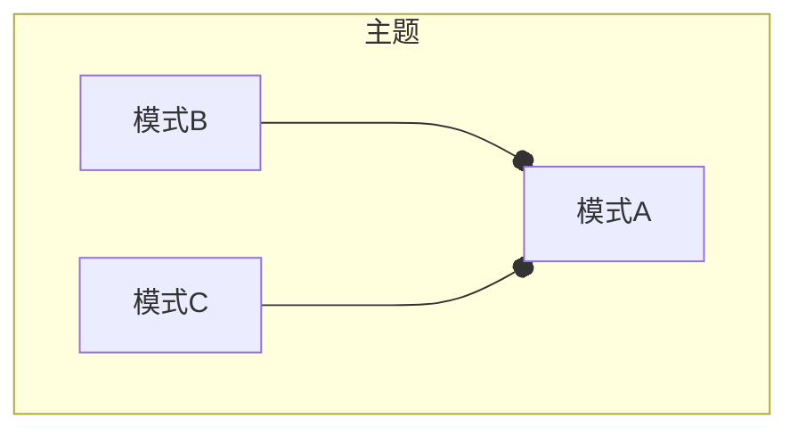
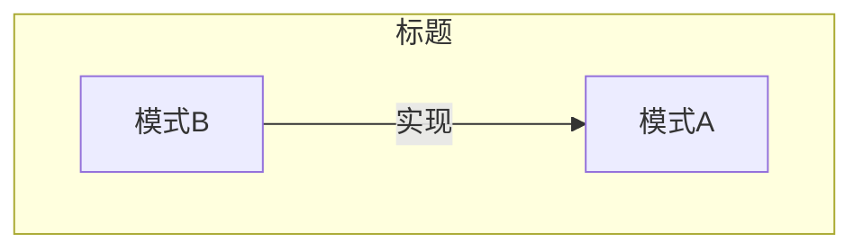
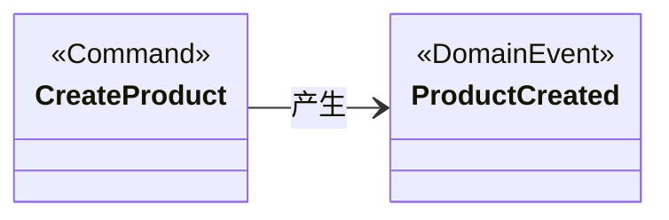
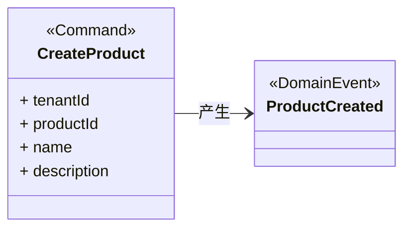
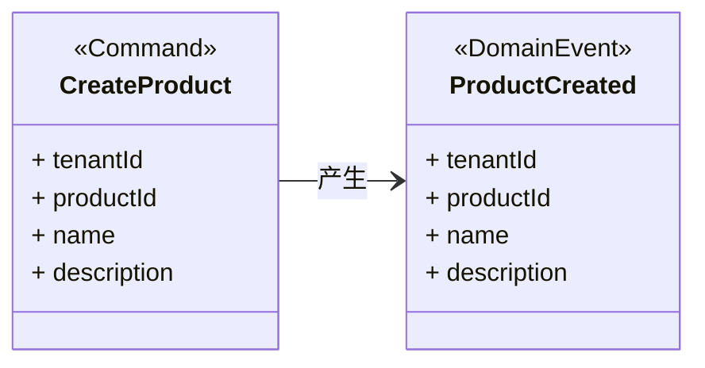
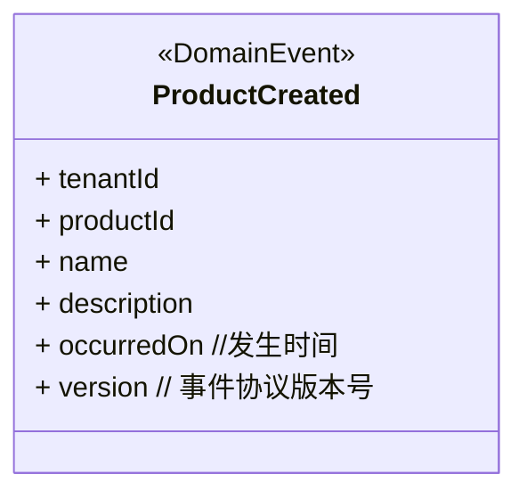

# 领域事件 Domain Event

## 1 参考资料

>给出具体的参考书籍和引用链接。如果书籍有购买地址或在线阅读地址，给出具体链接地址。如果是书中某一章节，必须标明是哪个章节。且如果书籍存在在线阅读的链接，应给出对应章节的具体链接地址。
>
> - 名称(链接)

- 领域驱动设计精粹 第6章 运用领域事件进行战术设计

## 2 什么是领域事件

> 有关该名词的定义。
> 
> 名词（English name），....具体概念描述....

领域事件 Domain Event，是一条记录，记录着在限界上下文（BoundedContext）中发生的对业务产生重要影响的事情。

## 3 影响（必须）

> 描述使用该模式产生的影响，可能是正面积极的影响，有时同时会存在负面的影响。

既是战略设计的重要工具，也是战术设计重要工具。

因果一致性（Casual）
如果业务领域中存在因果关系的操作——即一个操作会由另一个操作引起，那么这就是因果一致性。这种因果的线性系统架构可以通过创建并发布顺序正确的领域事件来轻松地实现。

## 4 上下文
> 以图形方式描述当前模式与其他模式之间的关系

- 关联

​	描述模式A与其他相关模式，如模式B存在关联关系。一般会用在当谈到模式A的时候，共同出现模式B等其他模式的概念，此时它们将共同解决某一主题范围内的问题。

- 输入

​	运用模式A的成果，作为模式B的输入。一般认为模式B是模式A的下一个步骤

- 使用

​	模式A在方案中使用到模式B

- 组合

​	模式B和模式C共同组成模式A

- 实现

​	模式A可以使用模式B实现

## 5 应用指南

> 描述使用该模式过程中需要注意的提示要点，或出现的常见问题及其对应的解决方案。

### 如何设计领域事件

#### 命名领域事件的类型

- 领域事件类型的名称应该是对过去发生的事情的陈述。推荐英文名称是：名词+动词的过去式，中文名称是：时间修辞词+动词+“的”+名词。

	例如：
		- ProductCreated 已创建的产品
		- SprintScheduled 已预定的冲刺
		- ReleaseScheduled 已预定的发布
		- BacklogItemPlanned 已计划的工作事项
		- BacklogItemCommited 已提交的工作办事项

- 应体现模型的[通用语言 Ubiquitous Language](%E9%80%9A%E7%94%A8%E8%AF%AD%E8%A8%80%20Ubiquitous%20Language)。这些词语将形成连接模型中所发生的事情和外部世界的桥梁。

#### 定义领域事件的属性

第一步：思考“是什么动作导致领域事件被发布出来？”动作是由某个[应用服务 Application Service](%E5%BA%94%E7%94%A8%E6%9C%8D%E5%8A%A1%20Application%20Service)中的某一个命令实现，命令就是方法或动作请求的对象形态（[命令模型 Command](%E5%91%BD%E4%BB%A4%E6%A8%A1%E5%9E%8B%20Command)）。

第二步：思考命令的对象中应该包括哪些属性。

第三步：思考领域事件。
领域事件包含导致包含命令提供的所有属性。领域事件将被发布出来通知所有订阅者。
此时，需要思考另外两种情况，
第一种情况，也许订阅者不希望消费太多的数据。这时候，消费者需通过在限界上下文的查询获取额外的数据，领域事件必须提供查询所需的唯一标识。
第二种情况，消费者希望在事件中获得额外的属性来增强领域事件。这样会很方便，带来的问题是太多的数据塞给领域事件，事件含义变得模糊，有可能对消费者的理解产生误导。

第四步，领域事件需要包括的额外一些属性

#### 持久化领域事件

在事件存储中对领域事件进行持久化，同时保留它们之间的因果顺序，这些顺序和在领域模型中发生的事件相关。

有两种方式实现领域事件持久化
- 使用事务处理机制，将聚合保存在对应它的实体表中，将领域事件保存在另一个事件存储表中。
- [事件溯源 Event Sourcing](%E4%BA%8B%E4%BB%B6%E6%BA%AF%E6%BA%90%20Event%20Sourcing)

当领域事件被保存后，它就可以发送给任何对它感兴趣的订阅方。

#### 消费领域事件

按照因果顺序保存领域事件并不能保证这些事件会以同样的顺序到达其他的分布式节点。因此，识别出正确因果关系的重任就落到了消费事件的限界上下文肩上。

#### 产生领域事件的原因

因果关系有几种方式可以表明
- 领域事件类型的内在因果关系表示
- 由领域事件关联一起的元数据表示，比如序列标识符、因果标识符。

如果原因事件尚未出现，消费者必须等它到达后才能处理先前到达的（结果）事件。某些情况下，可以忽略潜在的领域事件，这些事件已经被后续事件的关联动作取代，这种情况下因果关系具有可消除的影响。

尽管事件通常都是用户在用户界面发起的命令导致的，但有时领域事件可能由其他原因引起。这些原因可能是到期的计时器。

#### 命令与领域事件的不同点

命令是可以被拒绝，但领域事件是历史事实，必须被无条件接受。

## 6 样例（必须）

> 描述具体实践的样例，其中包含代码、具体方案。

这里填写...

## 7 批注

> 学习过程的思考笔记

这里填写...