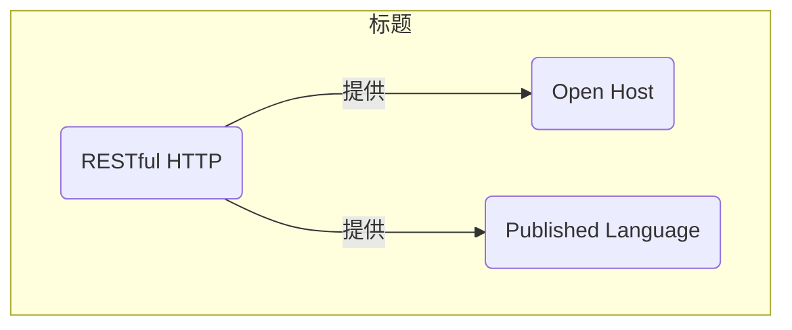

# 表象状态传递 REST

## 1 参考资料

>给出具体的参考书籍和引用链接。如果书籍有购买地址或在线阅读地址，给出具体链接地址。如果是书中某一章节，必须标明是哪个章节。且如果书籍存在在线阅读的链接，应给出对应章节的具体链接地址。
>
> - 名称(链接)

这里填写...

## 2 什么是表象状态传递

> 有关该名词的定义。
> 
> 名词（English name），....具体概念描述....

表象状态传递（Representational State Transfer，REST）是2000年Roy Fielding博士在他的博士论文中提出来的一种软件架构风格。REST围绕资源这个核心概念定义了一套标准的方法，而这套方法正好和HTTP的动词以及状态码匹配。随着互联网的发展，REST几乎成了API定义以及微服务通信的事实标准。REST会在DDD的上下文映射中得到应用。但需要注意的是，REST并不是真正意义上的标准，对它的理解和实现可谓百花齐放。在使用这种风格之前，请参考Richardson Maturity Model和一些公开的API设计范例（如GitHub API），来了解REST的最佳实践。此外，REST也不是唯一的选择，还有gRPC和graphQL这样的替代方案。

## 3 影响（必须）

> 描述使用该模式产生的影响，可能是正面积极的影响，有时同时会存在负面的影响。

支持REST接口的服务端限界上下文应该提供开放主机服务和已发布语言。资源理应被定义成已发布语言，而且当它们与你的REST URI结合在一起之后，将形成天然的开放主机服务。

使用RESTful HTTP的集成将注意力集中在限界上下文之间交换的资源上，还有相关的四个主要操作：POST、GET、PUT和DELETE。许多人发现采用REST方式进行集成效果很好，因为它可以帮助他们定义出非常适合分布式计算的API。

造成RESTful HTTP失败的原因通常和许多造成RPC失败的原因一样——网络或服务提供商故障，还有意外延迟。

使用RESTful HTTP的集成将注意力集中在限界上下文之间交换的资源上，还有相关的四个主要操作：POST、GET、PUT和DELETE。许多人发现采用REST方式进行集成效果很好，因为它可以帮助他们定义出非常适合分布式计算的API。

使用REST完成异步操作可以基于REST对有序增长的资源集合进行轮询达到异步消息机制的效果。客户端可以在后台进程中持续轮询一个Atom Feed[17]资源服务，该资源提供了一个持续增长的领域事件集合。这是一种维持服务和客户端之间异步操作的安全方法，同时还能提供服务中持续发生的最新事件。如果服务因某些原因而无法使用，则客户端将简单地在固定时间间隔之后重试，或以退避算法进行重试[18]，直到资源再次可用。

## 4 上下文
> 以图形方式描述当前模式与其他模式之间的关系

- 开发主机服务和已发布的语言，可以使用Restful HTTP实现。

## 5 应用指南

> 描述使用该模式过程中需要注意的提示要点，或出现的常见问题及其对应的解决方案。

使用REST常犯的设计错误是直接把模型中的聚合暴露成资源。服务端模型一旦发生变化，资源也会随之一起改变，这样会把跟随者关系强加给每个客户端。所以你不会想这样做。相反，应该根据客户端驱动的用例设计出“合成”的资源。所谓“合成”，是指对客户端来说，服务端提供出来的资源必须具有它们所需要的样子和组成，而不是直接给出实际的领域模型。有时候模型看起来就像客户端需要的东西。但客户端真正所需要的是驱动资源模型的设计，而不只是保持模型的皮囊。

## 6 样例（必须）

> 描述具体实践的样例，其中包含代码、具体方案。

这里填写...

## 7 批注

> 学习过程的思考笔记

这里填写...

