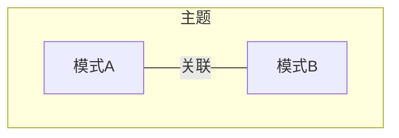
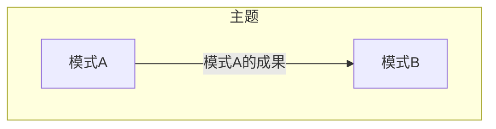
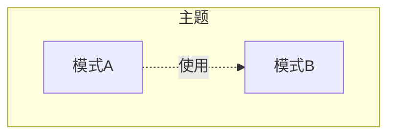
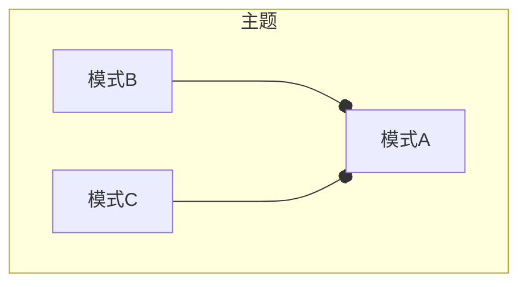
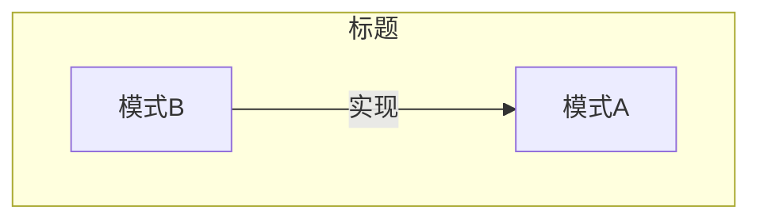

# 层超类型 Layer Supertype

## 1 参考资料

>给出具体的参考书籍和引用链接。如果书籍有购买地址或在线阅读地址，给出具体链接地址。如果是书中某一章节，必须标明是哪个章节。且如果书籍存在在线阅读的链接，应给出对应章节的具体链接地址。
>
> - 名称(链接)

- [企业应用架构模式 - 18.3 层超类型](https://weread.qq.com/web/reader/0923292072620d8b0926217k473326d031114734ba6fffe)
- https://www.ibm.com/docs/zh/db2/11.5?topic=types-structured-type-hierarchies
- https://www.sitepoint.com/the-layer-supertype-pattern-encapsulating-common-implementation-in-multi-tiered-systems/
- https://www.youtube.com/watch?v=DP1NBCBTHPs

## 2 什么是层超类型 Layer SuperType

> 有关该名词的定义。
> 
> 名词（English name），....具体概念描述....


在使用面向对象语言来开发领域模型时，我们通常喜欢通过继承来创建类型层级。此时，我们将默认状态和行为放在基类中，然后创建子类对其进行扩展。

所有的聚合类型都扩展自同一个层超类型

体现了Liskov替换原则

用于隐藏技术细节

如果一层中的组件具有相同的一组行为，就可以将这些行为提取到一个公共类或组件中，并使层中的所有组件都继承该公共类或组件。这不仅简化了维护并提高了可重用性，还允许通过对超类型（而不是特定组件）的运行时引用来调用公共行为，从而减少了层之间的依赖性。


## 3 影响（必须）

> 描述使用该模式产生的影响，可能是正面积极的影响，有时同时会存在负面的影响。

当某一层中所有对象都有公用特性时都可以适用。
-   减少冗余代码
-   当层超类型过多时可能导致代码层次过多降低阅读质量

## 4 上下文
> 以图形方式描述当前模式与其他模式之间的关系

- 关联

​	描述模式A与其他相关模式，如模式B存在关联关系。一般会用在当谈到模式A的时候，共同出现模式B等其他模式的概念，此时它们将共同解决某一主题范围内的问题。



- 输入

​	运用模式A的成果，作为模式B的输入。一般认为模式B是模式A的下一个步骤



- 使用

​	模式A在方案中使用到模式B



- 组合

​	模式B和模式C共同组成模式A



- 实现

​	模式A可以使用模式B实现



## 5 应用指南

> 描述使用该模式过程中需要注意的提示要点，或出现的常见问题及其对应的解决方案。


Mybatis中应用,BaseExecutor实现了Executor接口中的所有函数，并抽象出核心的3个函数doUpdate,doFlushStatements,doQuery。子类中只需实现这3个函数即可。

  
  
隐藏技术细节的常见做法：

-   隐藏数据库自动ID，隐藏委派标识

```java
public abstract class IdentifiedDomainObject {

    private static final longserialVersionUID= 1L;

    private long id;

    protected IdentifiedDomainObject() {
        super();

        this.setId(-1);
    }

    protected long id() {
        return this.id;
    }

    private void setId(long anId) {
        this.id = anId;
    }
}
```

- 管理委派标识和乐观并发的版本号
```java
public class ConcurrencySafeEntity extends Entity {

    private static final long serialVersionUID = 1L;

    private int concurrencyVersion;

    protected ConcurrencySafeEntity() {
        super();
    }

    public int concurrencyVersion() {
        return this.concurrencyVersion;
    }

    public void setConcurrencyVersion(int aVersion) {
        this.failWhenConcurrencyViolation(aVersion);
        this.concurrencyVersion = aVersion;
    }

    public void failWhenConcurrencyViolation(int aVersion) {
        if (aVersion != this.concurrencyVersion()) {
            throw new IllegalStateException(
                    "Concurrency Violation: Stale data detected. Entity was already modified.");
        }
    }
}
```


## 6 样例（必须）

> 描述具体实践的样例，其中包含代码、具体方案。

这里填写...

## 7 批注

> 学习过程的思考笔记

这里填写...